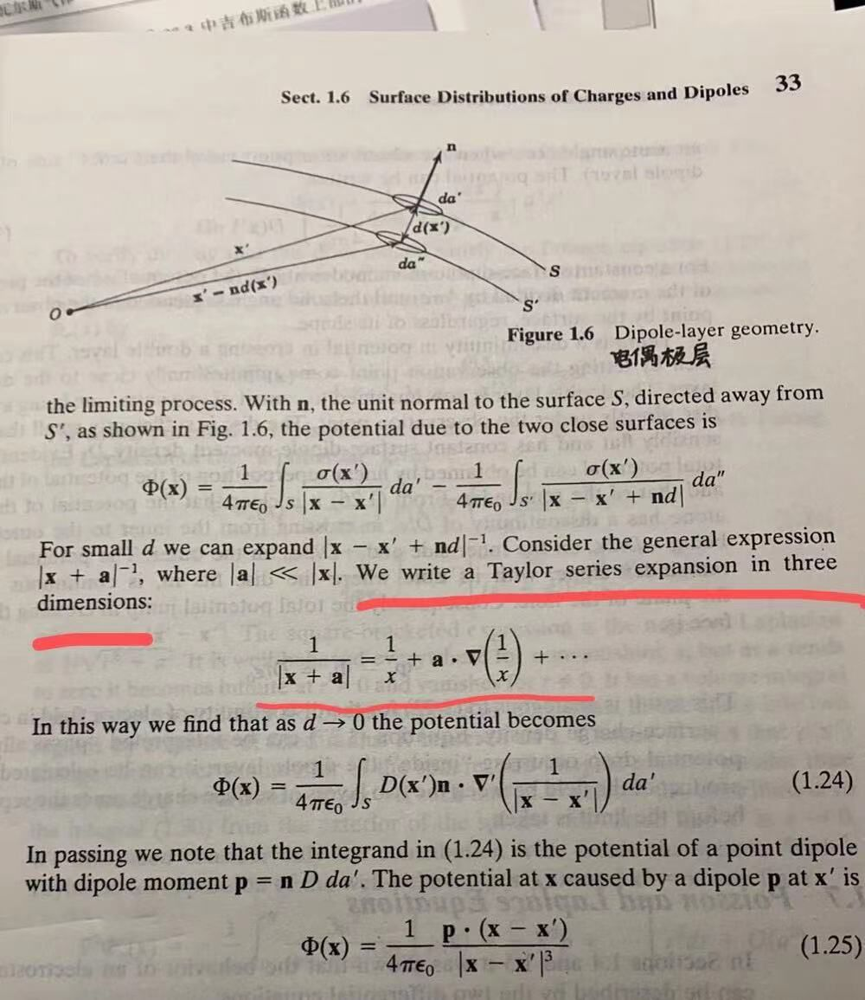

# 泰勒展开的几种形式

> 这一篇是我大一看电动力学时写的，数学严谨性不是很强，更适合看作一种记忆方法

## 一般形式

二元函数的泰勒展开的一般形式为

$$
f(x_{0} + \Delta x,y_{0} + \Delta y) = \\
f(x_{0},y_{0}) \\
+ \left[ \left.\frac{\partial f}{\partial x}\right|_{(x_{0},y_{0})}\Delta x + \left.\frac{\partial f}{\partial y}\right|_{(x_{0},y_{0})}\Delta y\right] \\
+ \left[ \left.\frac{\partial^{2} f}{\partial x^{2}}\right|_{(x_{0},y_{0})}\Delta x^{2} + \left.\frac{\partial^{2} f}{\partial x\partial y}\right|_{(x_{0},y_{0})}\Delta x \Delta y + \left.\frac{\partial^{2} f}{\partial y\partial x}\right|_{(x_{0},y_{0})}\Delta x \Delta y  + \left.\frac{\partial^{2} f}{\partial y^{2}}\right|_{(x_{0},y_{0})}\Delta y^{2} \right]\\
+\cdots
$$

只有二阶混合偏导数存在且连续的函数，两个二阶混合偏导数才相等。

## 矩阵形式

展开式中的混合偏导数项（第二项）有时候会借助Hessian矩阵

$$
H_{f} = 
\begin{bmatrix} \dfrac{\partial^{2} f}{\partial x^{2}} & \dfrac{\partial^{2} f}{\partial y\partial x} \\ \dfrac{\partial^{2} f}{\partial x\partial y} & \dfrac{\partial^{2} f}{\partial y^{2}} \end{bmatrix}_{(x_0,y_0)}
$$

表达为如下形式

$$
\begin{bmatrix} \Delta x & \Delta y  \end{bmatrix}
H_{f}
 \begin{bmatrix} \Delta x \\ \Delta y  \end{bmatrix}
$$

借此可以形式上把展开式表示为

$$
f(x_{0} + \Delta x,y_{0} + \Delta y) = f(x_{0},y_{0}) 
+ \begin{bmatrix} \Delta x & \Delta y  \end{bmatrix}
\begin{bmatrix} \left.\frac{\partial f}{\partial x}\right|_{(x_{0},y_{0})} \\ \left.\frac{\partial f}{\partial y}\right|_{(x_{0},y_{0})}  \end{bmatrix} 
+ \begin{bmatrix} \Delta x & \Delta y  \end{bmatrix}
H_{f}
 \begin{bmatrix} \Delta x \\ \Delta y  \end{bmatrix}
$$

## 矢量形式

为了与电动力学中使用到的记号相匹配，引入右作用的微分算子

$$
\mathrm{d} = \left( \Delta x \frac{\partial}{\partial x} + \Delta y \frac{\partial}{\partial y}\right)
$$

来描述微分操作，发现泰勒展开式可以写作

$$
f(x_{0} + \Delta x,y_{0} + \Delta y) \\
= f(x_{0},y_{0}) \\
+ \left[ \Delta x\frac{\partial }{\partial x} + \Delta y \frac{\partial }{\partial y} \right]_{(x_{0},y_{0})}f \\
+ \left[ \Delta x^{2} \frac{\partial^{2} }{\partial x^{2}} + \Delta x \Delta y\frac{\partial^{2} }{\partial x\partial y} + \Delta x \Delta y\frac{\partial^{2} }{\partial y\partial x} + \Delta y^{2} \frac{\partial^{2} }{\partial y^{2}} \right]_{(x_{0},y_{0})}f\\
+\cdots
$$

由于二阶项形式上等于

$$
 \left[ \Delta x^{2} \frac{\partial^{2} }{\partial x^{2}} + \Delta x \Delta y\frac{\partial^{2} }{\partial x\partial y} + \Delta x \Delta y\frac{\partial^{2} }{\partial y\partial x} + \Delta y^{2} \frac{\partial^{2} }{\partial y^{2}} \right]_{(x_{0},y_{0})}f\\
=\left[ \Delta x\frac{\partial }{\partial x} + \Delta y \frac{\partial }{\partial y} \right]_{(x_{0},y_{0})}^{2} f
$$

所以泰勒展开写作

$$
f(x_{0} + \Delta x,y_{0} + \Delta y) \\
= f(x_{0},y_{0}) \\
+ \left[ \Delta x\frac{\partial }{\partial x} + \Delta y \frac{\partial }{\partial y} \right]_{(x_{0},y_{0})}f \\
+ \left[ \Delta x\frac{\partial }{\partial x} + \Delta y \frac{\partial }{\partial y} \right]_{(x_{0},y_{0})}^{2} f\\
+\cdots
$$

即

$$
f(x_{0} + \Delta x,y_{0} + \Delta y) = f(x_{0},y_{0}) +\mathrm{d}f + \mathrm{d}^{2}f+\cdots
$$

对比一元函数的泰勒展开

$$
f(x+\Delta x) = f(x) + \frac{\mathrm{d}f}{\mathrm{d}x} \Delta x + \frac{\mathrm{d}^{2}f}{\mathrm{d}x^{2}}\Delta x^{2} + \cdots
$$

一方面，将其看作

$$
f(x+\Delta x) = f(x) +  (\Delta x\frac{\mathrm{d}}{\mathrm{d}x})f + (\Delta x^{2}\frac{\mathrm{d}^{2}}{\mathrm{d}x^{2}})f + \cdots
$$

是与上面的多元展开形式

$$
f(x_{0} + \Delta x,y_{0} + \Delta y) \\= f(x_{0},y_{0}) \\
+\left[ \Delta x\frac{\partial }{\partial x} + \Delta y \frac{\partial }{\partial y} \right]_{(x_{0},y_{0})}f \\
+ \left[ \Delta x\frac{\partial }{\partial x} + \Delta y \frac{\partial }{\partial y} \right]_{(x_{0},y_{0})}^{2} f
\\
+\cdots
$$

是吻合的。另一方面，如果近似认为泰勒展开是对于一个小量增量$\Delta x$展开的，则$\Delta x \sim \mathrm{d}x$，于是可以直接从

$$
f(x+\Delta x) = f(x) + \frac{\mathrm{d}f}{\mathrm{d}x} \Delta x + \frac{\mathrm{d}^{2}f}{\mathrm{d}x^{2}}\Delta x^{2} + \cdots
$$

中将$\Delta x$和$\mathrm{d}x$约掉，一元函数泰勒展开形式就变为

$$
f(x+\Delta x) = f(x) + \mathrm{d}f  + \mathrm{d}^{2}f + \cdots
$$

这与前面得到的多元函数泰勒展开的形式也是符合的

$$
f(x_{0} + \Delta x,y_{0} + \Delta y) = f(x_{0},y_{0}) +\mathrm{d}f + \mathrm{d}^{2}f+\cdots
$$

也是吻合的。总结来说，微分算子

$$
\mathrm{d} = \left( \Delta x \frac{\partial}{\partial x} + \Delta y \frac{\partial}{\partial y}\right)
$$

恰当的描述了多元函数的微分，形式

$$
f(x_{0} + \Delta x,y_{0} + \Delta y) = f(x_{0},y_{0}) +\mathrm{d}f + \mathrm{d}^{2}f+\cdots
$$

已经相当好理解。

然而，在物理中更多使用的是矢量形式，借助nabla算子

$$
\nabla = \frac{\partial }{\partial x_1} \boldsymbol{e}_1 + \frac{\partial }{\partial x_2} \boldsymbol{e}_2
$$

将自变量看作矢量$\boldsymbol{x} = (x_{1},x_{2})$，将$\boldsymbol{x}_{0} = (x_{01},x_{02})$当作展开处的点，将$\Delta \boldsymbol{x} = (\Delta x_{1},\Delta x_{2})$看作增量，发现微分算子

$$
\mathrm{d} = \left( \Delta x \frac{\partial}{\partial x} + \Delta y \frac{\partial}{\partial y}\right) \\
= (\Delta x_{1},\Delta x_{2}) \cdot (\frac{\partial}{\partial x_1},\frac{\partial}{\partial x_2})\\
= \Delta \boldsymbol{x} \cdot \nabla
$$

于是将

$$
f(x_{01} + \Delta x,x_{02} + \Delta y) = f(x_{01},x_{02}) +\mathrm{d}f + \mathrm{d}^{2}f+\cdots
$$

改写为

$$
f(\boldsymbol{x}_0 + \Delta \boldsymbol{x}) = f(\boldsymbol{x}_0) +(\Delta \boldsymbol{x} \cdot \nabla)_{\boldsymbol{x}_0}f + (\Delta \boldsymbol{x} \cdot \nabla)_{\boldsymbol{x}_0}^{2}f+\cdots
$$

成为一个新形式的表达式。

## 总结

总结上述讨论，多元函数的泰勒展开可以写为一般形式

$$
f(x_{0} + \Delta x,y_{0} + \Delta y) = \\
f(x_{0},y_{0}) \\
+ \left[ \left.\frac{\partial f}{\partial x}\right|_{(x_{0},y_{0})}\Delta x + \left.\frac{\partial f}{\partial y}\right|_{(x_{0},y_{0})}\Delta y\right] \\
+ \left[ \left.\frac{\partial^{2} f}{\partial x^{2}}\right|_{(x_{0},y_{0})}\Delta x^{2} + \left.\frac{\partial^{2} f}{\partial x\partial y}\right|_{(x_{0},y_{0})}\Delta x \Delta y + \left.\frac{\partial^{2} f}{\partial y\partial x}\right|_{(x_{0},y_{0})}\Delta x \Delta y  + \left.\frac{\partial^{2} f}{\partial y^{2}}\right|_{(x_{0},y_{0})}\Delta y^{2} \right]\\
+\cdots
$$

矩阵形式

$$
f(x_{0} + \Delta x,y_{0} + \Delta y) = f(x_{0},y_{0}) 
+ \begin{bmatrix} \Delta x & \Delta y  \end{bmatrix}
\begin{bmatrix} \left.\frac{\partial f}{\partial x}\right|_{(x_{0},y_{0})} \\ \left.\frac{\partial f}{\partial y}\right|_{(x_{0},y_{0})}  \end{bmatrix} 
+ \begin{bmatrix} \Delta x & \Delta y  \end{bmatrix}
H_{f}
 \begin{bmatrix} \Delta x \\ \Delta y  \end{bmatrix}
$$

和矢量形式

$$
\boxed{
    f(\boldsymbol{x}_0 + \Delta \boldsymbol{x}) = f(\boldsymbol{x}_0) +(\Delta \boldsymbol{x} \cdot \nabla)_{\boldsymbol{x}_0}f + (\Delta \boldsymbol{x} \cdot \nabla)_{\boldsymbol{x}_0}^{2}f+\cdots
}
$$

在Jackson的《经典电动力学》中，用矢量形式展开的级数频繁出现，如

基于nabla算子的矢量展开形式方便了积分的运算，所以在电动力学经常使用。
