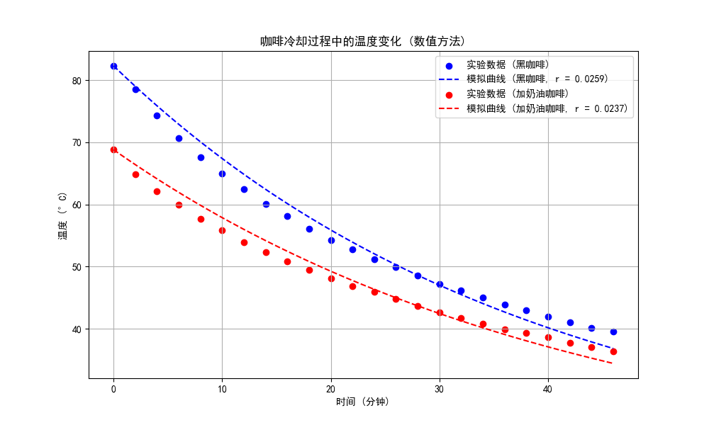
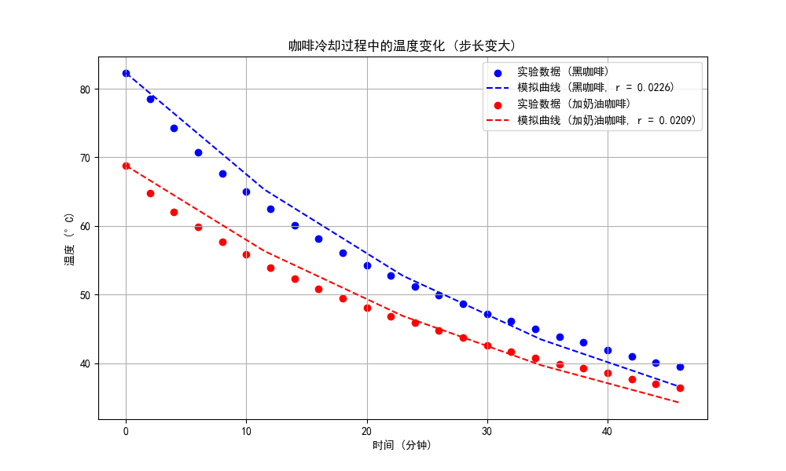
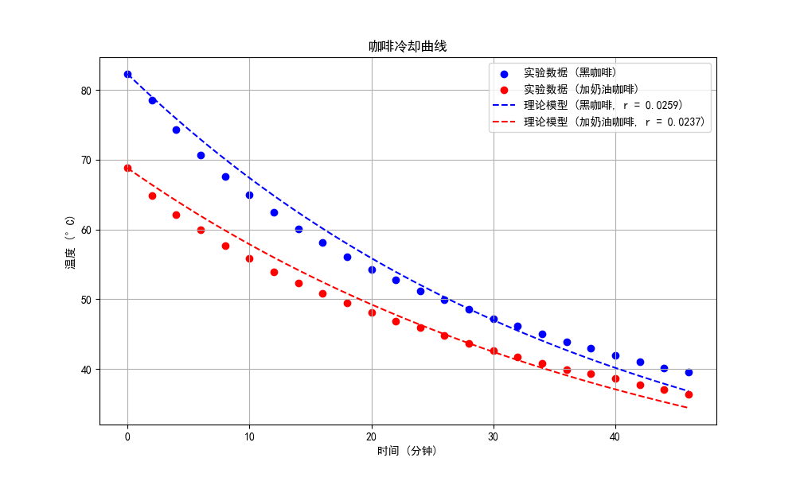
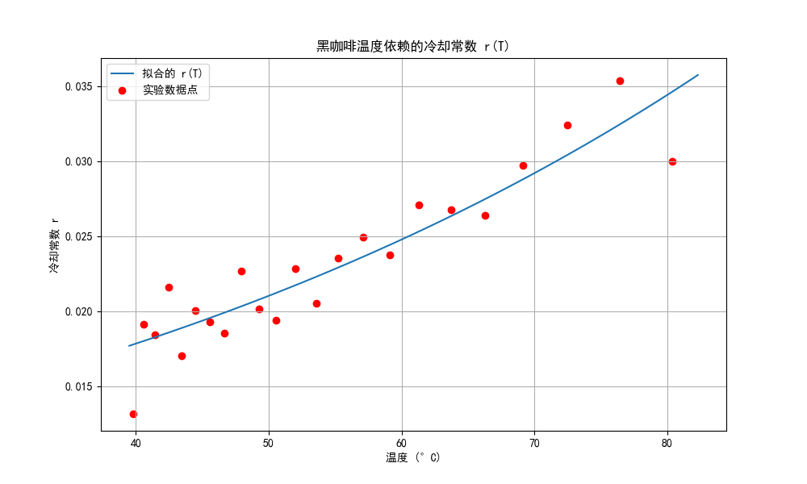
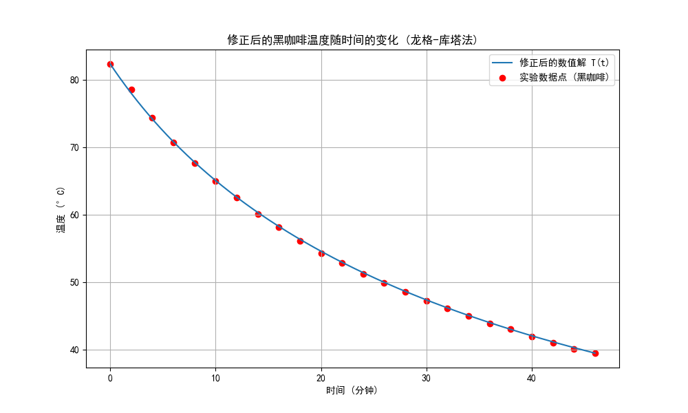

# <center>Coffee cooling program

## (a) 确定冷却常数

> 根据牛顿冷却定律，找出描述以下表格中实验结果的黑咖啡和加奶油咖啡的 $r$ 近似值（从以下表格中判断 r 是否为常数）。你确定 $r$ 最佳值的隐含标准是什么？给出确定 $r$ 最佳值的两种方法，并论证哪种更好以及为什么更好。因为时间是以分钟为单位测量的，所以冷却常数 $r$ 的单位是 $\min^{-1}$。

牛顿冷却定律为

$$
\frac{\mathrm{d}}{\mathrm{d} t}T(t) = r(T_{\text{env}}-T(t))
$$

为了利用表格中的实验数据找出描述黑咖啡和加奶油咖啡冷却过程的 $r$ 近似值，一种简单的设想是分两步进行：

1. 使用欧拉法求解牛顿冷却定律的微分方程，得到$T_{\text{num}}(t_i;r)$，其包含一系列间隔为时间步长$t_{i+1}-t_{i} = \Delta t$的数据点
2. 设置目标函数$\displaystyle\text{Obj}(r) = \sum_{t_i}(\text{Data}(t_i) - T_{\text{num}}(t_i;r))^2$，在两种情况下分别将其最小化以找出最合适的$r$值

其代码（使用`python`语言）实现如下，首先导入计算所需的库

```{.python .copy}
import numpy as np
from scipy.optimize import minimize_scalar
import matplotlib.pyplot as plt
```

定义记录实验数据的数组

```{.python .copy}
time = np.array([0, 2, 4, 6, 8, 10, 12, 14, 16, 18, 20, 22, 24, 26, 28, 30, 32, 34, 36, 38, 40, 42, 44, 46])
temp_black = np.array([82.3, 78.5, 74.3, 70.7, 67.6, 65.0, 62.5, 60.1, 58.1, 56.1, 54.3, 52.8, 51.2, 49.9, 48.6, 47.2, 46.1, 45.0, 43.9, 43.0, 41.9, 41.0, 40.1, 39.5])
temp_cream = np.array([68.8, 64.8, 62.1, 59.9, 57.7, 55.9, 53.9, 52.3, 50.8, 49.5, 48.1, 46.8, 45.9, 44.8, 43.7, 42.6, 41.7, 40.8, 39.9, 39.3, 38.6, 37.7, 37.0, 36.4])
T_env = 17
```

其中`temp_black`和`temp_cream`分别表示黑咖啡和加奶油咖啡的实验数据。

现在，定义两个函数，第一个函数使用欧拉法求解微分方程得到$T_{\text{num}}(t_i;r)$

```{.python .copy}
def euler_solve(r, T_initial, time_points):
    dt = (time_points[-1] - time_points[0]) / (len(time_points) - 1)
    T = np.zeros_like(time_points)
    T[0] = T_initial
    for i in range(1, len(time_points)):
        dTdt = -r * (T[i-1] - T_env)
        T[i] = T[i-1] + dTdt * dt
    return T
```

第二个函数定义待最小化的目标函数$\text{Obj}(r)$

```{.python .copy}
def objective_function(r, T_initial, temp, time_points):
    T_model_full = euler_solve(r, T_initial, time_points)
    T_model = np.interp(time, time_points, T_model_full)  # 插值以匹配实验数据时间点
    return np.sum((temp - T_model)**2)
```

此处由于欧拉法求解出的数据点可能比实验数据多，因此需要进行插值，选取实验数据时间对应的数据点来与实验顺序进行比较，这个功能使用`numpy`库中的`np.interp`函数来实现。

现在确定冷却常数，首先需要利用欧拉法解出$T_{\text{num}}(t_i;r)$，为此需要设定时间步长

$$
\Delta t = \frac{t_{\max}-t_{\min}}{N}
$$

选取$N=500$，即选取时间步长为$\Delta t = 0.092\text{min}$，这样可以定义用于记录解出来的$T_{\text{num}}(t_i;r)$的数组，将其初始化为

```{.python .copy}
time_continuous = np.linspace(0, max(time), 500) # 即确定时间步长
```

然后分别寻找黑咖啡的冷却常数估计值

```{.python .copy}
result_black = minimize_scalar(objective_function, args=(temp_black[0], temp_black, time_continuous), bounds=(0.001, 0.1), method='bounded')
r_black = result_black.x
```

和加奶油咖啡的冷却常数估计值

```{.python .copy}
result_cream = minimize_scalar(objective_function, args=(temp_cream[0], temp_cream, time_continuous), bounds=(0.001, 0.1), method='bounded')
r_cream = result_cream.x
```

其中对目标函数$\text{Obj}(r)$的最小化借助`SciPy`库中的`minimize_scalar`函数完成，这个函数基于结合了黄金分割搜索和抛物线插值的Brent's方法,能快速求出使目标函数最小化的$r$值。将结果打印出来

```{.python .copy}
print(r_black,r_cream)
```

输出为

```
0.02589108681175482 0.023674438444012683
```

这说明数值解出的结果为

$$
r_{\text{black}} = 0.02589108681175482\text{min}^{-1}\\
r_{\text{cream}} = 0.023674438444012683\text{min}^{-1}
$$


## (b) 可视化

> 使用在 (a) 部分中找到的 $r$ 值，绘制温度随时间变化的图表。将表中的数据绘制在同一图表上，并与你的结果进行比较。你可以使用任何图形包来绘制图表。

为了在图片中使用中文，还需设置中文字体，使用`matplotlib`库实现

```{.python .copy}
import matplotlib
matplotlib.rcParams['font.sans-serif'] = ['SimHei']
matplotlib.rcParams['font.family'] = 'sans-serif'
```

在上一小问第一种方法的代码后，绘制温度随时间变化的图标，首先将欧拉法求解出的数据点记录下来

```{.python .copy}
T_pred_black = euler_solve(r_black, temp_black[0], time_continuous)
T_pred_cream = euler_solve(r_cream, temp_cream[0], time_continuous)
```

然后进行图表绘制

```{.python .copy}
plt.figure(figsize=(10, 6))
plt.scatter(time, temp_black, color='blue', label='实验数据 (黑咖啡)')
plt.plot(time_continuous, T_pred_black, color='blue', linestyle='dashed', label=f'模拟曲线 (黑咖啡, r = {r_black:.4f})')
plt.scatter(time, temp_cream, color='red', label='实验数据 (加奶油咖啡)')
plt.plot(time_continuous, T_pred_cream, color='red', linestyle='dashed', label=f'模拟曲线 (加奶油咖啡, r = {r_cream:.4f})')
plt.title('咖啡冷却过程中的温度变化 (数值方法)')
plt.xlabel('时间 (分钟)')
plt.ylabel('温度 (°C)')
plt.legend()
plt.grid(True)
plt.show()
```

输出为




## (c) 讨论时间步长

> 时间步长 $\Delta t$ 有无物理意义？确保你选择的 $\Delta t$ 足够小，以至于不会影响你的结果。你应该估算结果的误差。

首先，仅从数值模拟的层面来说，时间步长影响的是模拟的精度。欧拉法本质上是用泰勒级数的一阶项近似整个变化，从而可以做误差分析

- 每一步的误差：做近似$T(t_{n+1}) = T(t_n+\Delta t) = T(t_n) + T^{\prime}(t_n)\Delta t + \dfrac{T^{\prime\prime}(t_n)}{2}(\Delta t)^2+\cdots \approx T(t_n) + T^{\prime}(t_n)\Delta t$，即误差的领头阶是$(\Delta t)^2$
- 总的误差：由于求解的次数为时间区间除以时间步长，因此求解的次数正比于$1/\Delta t$，因而总的误差为每一步的误差乘以求解的步数，从而正比于$\Delta t$

即每一步的误差为$(\Delta t)^2$的量级而总的误差为$\Delta t$的量级，如果时间步长过小，则模拟结果不会很好，例如调整时间步长为$N=5\Rightarrow \Delta t=9.2\text{min}$，在上述算法下得到的结果如下图所示



其相对而言是不准确的。为了说明这一点，可以直接将微分方程的解析解求出

$$
T(t) = T_{\text{env}} + (T_{\text{intial}} - T_{\text{env}})e^{-rt}
$$

将其定义为牛顿冷却函数

```{.python .copy}
def newton_cooling(t, T_initial, r):
    return T_env + (T_initial - T_env) * np.exp(-r * t)
```

再将目标函数设置为

```{.python .copy}
def objective_function(r, T_initial, temp):
    return np.sum((temp - newton_cooling(time, T_initial, r))**2)
```

进行最小化后，可以得到输出

```
0.0259216837503887 0.023699673218806342
```

这说明对解析解求解出的冷却常数估计值为

$$
r_{\text{black}} = 0.0259216837503887\text{min}^{-1}\\
r_{\text{cream}} = 0.023699673218806342\text{min}^{-1}
$$

图像为



显然，像(a)小问那样采用更小的时间步长得到的结果与解析解更接近，在小数点后四位的精度下冷却常数（即(a)小问）和图像层面（即(b)小问）可看出采用$N=500\Rightarrow \Delta t = 0.092\text{min}$的时间步长是比较准确的。

当然，以上都是从数值解精确度的层面进行讨论，对于时间步长的物理意义，我认为其选取反应了**过程的时间尺度**。选取的时间步长应该与物理现象的时间尺度接近，这样才能捕捉到这一过程中重要的物理变化。


## (d) 实例计算

> 黑咖啡与周围环境的初始温差大约为 $76{}^{\circ}\text{C}$。咖啡冷却到温差为 $76/2 = 38{}^{\circ}\text{C}$ 需要多长时间？温差变为 $76/4$ 和 $76/8$ 需要多长时间？试图在不首先使用计算机的情况下用简单的术语理解你的结果。

采用(a)小问中第一种方法求解出的冷却常数估计值$r_{\text{black}}=0.02589108681175482\text{min}^{-1}$，进行数据初始化

```{.python .copy}
T_initial_black = 82.3  # 黑咖啡的初始温度 (°C)
T_env = 17  # 环境温度 (°C)
dt = 0.1  # 时间步长 (分钟)
r_black = 0.02589108681175482 # 第一种数值方法解出的冷却常数 (/分钟)
```

然后定义计算温差变为原始温差的$1/2, 1/4, 1/8$时所需时间的函数

```{.python .copy}
def time_for_temp_reduction(T_initial, r, reduction_factors, T_env, dt):
    times = []
    for factor in reduction_factors:
        T_target = T_env + (T_initial - T_env) / factor
        T_current = T_initial
        t = 0
        while T_current > T_target:
            T_current += -r * (T_current - T_env) * dt
            t += dt
        times.append(t)
    return times
```

计算黑咖啡冷却到不同温差所需的时间

```{.python .copy}
time_reduction_factors = [2, 4, 8]
times_black = time_for_temp_reduction(T_initial_black, r_black, time_reduction_factors, T_env, dt)
```

用`print(times_black)`输出结果，输出为

```
[26.80000000000011, 53.50000000000049, 80.29999999999971]
```

这说明

1. 当温差减小到原始温差的一半时，所需时间大约为 26.8 分钟。
2. 当温差减小到原始温差的四分之一时，所需时间大约为 53.5 分钟。
3. 当温差减小到原始温差的八分之一时，所需时间大约为 80.3 分钟。

在不使用计算机术语的情况下，这个结果说明**温度每下降为当前的一半花费的时间大致相同**，在这里大约是$26.7\text{min}$。

这个结果可以由解析解形式明显看出
$$
T(t) = T_{\text{env}} + (T_{\text{intial}} - T_{\text{env}})e^{-rt}
$$

考虑

$$
T(t_1) - T_{\text{env}}= (T_{\text{intial}} - T_{\text{env}})e^{-rt_1}\\
T(t_2) - T_{\text{env}} = \frac{T(t_1) - T_{\text{env}}}{2} = (T_{\text{intial}} - T_{\text{env}})e^{-rt_2}
$$

即

$$
\frac{1}{2} = e^{-r(t_2-t_1)}
$$

取对数得

$$
-\ln 2 = -r(t_2-t_1)
$$

故当前温度与环境温度的温度差$\Delta T$的”半衰期“为

$$
t_2-t_1 = \frac{\ln 2}{r}
$$

是常数，与温度无关。


## (e) 关于牛顿冷却定律适用程度的讨论

> 参考表格，讨论牛顿冷却定律是否适用于一杯咖啡的冷却，以及可以做哪些修改？

牛顿冷却定律其实也可以视为一阶近似，因为对于温度函数$T(t)$，写出其导数

$$
\frac{\mathrm{d}T}{\mathrm{d}t}=f(T)
$$

即温度随时间的变化由某个函数$f(t)$给出。假设环境温度为$T_{\text{env}}$，可以预料如果咖啡的温度与环境相当接近，则热量就不会发生交换，从而没有热量传递，温度不变。此时$(T-T_{\text{env}})^n$非常小，所以只有$0$阶项主导，可以预计

$$
f(T_{\text{env}}) = \left.\frac{\mathrm{d}T}{\mathrm{d}t}\right|_{T\equiv T_{\text{env}}} = 0
$$

在环境温度附近展开$f(t)$，得

$$
\frac{\mathrm{d}T(t)}{\mathrm{d}t}=f(T_{\text{env}}) + f^{\prime}(T_{\text{env}})(T-T_{\text{env}}) + \frac{1}{2!}f^{\prime\prime}(T_{\text{env}})(T-T_{\text{env}})^2 + \cdots
$$

代入$f(T_{\text{env}})=0$，如果能略去高阶项，记$r=f^{\prime}(T_{\text{env}})$，就可以得到牛顿冷却定律

$$
\frac{\mathrm{d}}{\mathrm{d} t}T(t) = r(T_{\text{env}}-T(t))
$$

然而，对于一杯咖啡的冷却，温度差在$10^1>1$摄氏度量级，此时高阶项的贡献不是越来越小而是越来越大，因此不能简单将级数保留到一阶，甚至整个级数会发散，因此预计在高温差区间内牛顿冷却定律是不准确的。这一点可以从理论解的图像中看出，可以看出当时间从右往左，即温度逐渐升高时，**表格中**实验数据点的温度上升趋势要明显快于拟合曲线。

为了处理这个问题，可以类比量子场论中的重整化技术，将高阶项吸收到$r$中，即

$$
\frac{\mathrm{d}T(t)}{\mathrm{d}t}=f(T_{\text{env}}) + f^{\prime}(T_{\text{env}})(T-T_{\text{env}}) + \frac{1}{2!}f^{\prime\prime}(T_{\text{env}})(T-T_{\text{env}})^2 + \cdots\\
= 0 + f^{\prime}(T_{\text{env}})(T-T_{\text{env}}) + \frac{1}{2!}f^{\prime\prime}(T_{\text{env}})(T-T_{\text{env}})^2 + \cdots\\
= (T-T_{\text{env}})\left[f^{\prime}(T_{\text{env}}) + \frac{1}{2!}f^{\prime\prime}(T_{\text{env}})(T-T_{\text{env}}) + \cdots\right]\\
\equiv (T-T_{\text{env}})[-r(T)]
$$

即

$$
\frac{\mathrm{d}T(t)}{\mathrm{d}t} = r(T(t))(T_{\text{env}}-T(t))
$$

获得一个随温度”跑动的“冷却常数$r(T)$，将其作为一个实验待测量。在本问题中，如果做此处理，则微分方程不再是线性的，可以按如下步骤进行探究

- 根据实验数据估计$r(T)$
- 利用Runge-Kutta法数值求解方程来观察实验数据与拟合曲线的符合情况

以黑咖啡为例，首先还是导入所需的库

```{.python .copy}
import numpy as np
import matplotlib.pyplot as plt
from scipy.optimize import curve_fit
import matplotlib
matplotlib.rcParams['font.sans-serif'] = ['SimHei']
matplotlib.rcParams['font.family'] = 'sans-serif'
```

并定义好实验数据

```{.python .copy}
time = np.array([0, 2, 4, 6, 8, 10, 12, 14, 16, 18, 20, 22, 24, 26, 28, 30, 32, 34, 36, 38, 40, 42, 44, 46])
temp_black = np.array([82.3, 78.5, 74.3, 70.7, 67.6, 65.0, 62.5, 60.1, 58.1, 56.1, 54.3, 52.8, 51.2, 49.9, 48.6, 47.2, 46.1, 45.0, 43.9, 43.0, 41.9, 41.0, 40.1, 39.5])
T_env = 17
```

为了估计$r(T)$的形式，先计算黑咖啡的温度变化率

```{.python .copy}
dTdt_black = np.diff(temp_black) / np.diff(time)
T_midpoints_black = (temp_black[:-1] + temp_black[1:]) / 2
```

使用指数拟合$r(T)$（可以用更高级的数值拟合，但随后会看到，指数拟合已经足够好）

```{.python .copy}
def r_fit_positive(T, a, b):
    return a * np.exp(-b * (T - T_env))
```

注意这样的设置能保证在咖啡温度接近环境温度时，$r(T)$趋于常数$a$。现在，利用黑咖啡的温度变化率进行拟合

```{.python .copy}
params_black_positive, _ = curve_fit(r_fit_positive, T_midpoints_black, dTdt_black / (T_env - T_midpoints_black), p0=[0.1, 0.01])
```

其中用到了`curve_fit`函数，它会根据实验数据，基于 Levenberg-Marquardt 算法确定$a$和$b$的取值。借助上述步骤，可以定出$r(T)$的一个估计，可以用如下代码绘制$r(T)-T$图

```{.python .copy}
T_range = np.linspace(min(temp_black), max(temp_black), 100)
r_values = r_fit_positive(T_range, *params_black_positive)

plt.figure(figsize=(10, 6))
plt.plot(T_range, r_values, label="拟合的 r(T)")
plt.scatter(T_midpoints_black, dTdt_black / (T_env - T_midpoints_black), color='red', label="实验数据点")
plt.title("黑咖啡温度依赖的冷却常数 r(T)")
plt.xlabel("温度 (°C)")
plt.ylabel("冷却常数 r")
plt.legend()
plt.grid(True)
plt.show()
```

输出为



现在，利用Runge-Kutta法数值求解方程获得拟合曲线，首先定义其算法函数

```{.python .copy}
def runge_kutta_method_corrected(T_initial, time_points, r_func, params, T_env):
    T = np.zeros_like(time_points)
    T[0] = T_initial
    dt = time_points[1] - time_points[0]
    for i in range(1, len(time_points)):
        k1 = dt * -r_func(T[i-1], *params) * (T[i-1] - T_env)
        k2 = dt * -r_func(T[i-1] + 0.5 * k1, *params) * (T[i-1] + 0.5 * k1 - T_env)
        k3 = dt * -r_func(T[i-1] + 0.5 * k2, *params) * (T[i-1] + 0.5 * k2 - T_env)
        k4 = dt * -r_func(T[i-1] + k3, *params) * (T[i-1] + k3 - T_env)
        T[i] = T[i-1] + (k1 + 2 * k2 + 2 * k3 + k4) / 6
    return T
```

然后根据实验数据和$r(T)$的估计曲线进行求解

```{.python .copy}
time_continuous = np.linspace(0, max(time), 500)
T_pred_black_runge_kutta_positive = runge_kutta_method_corrected(temp_black[0], time_continuous, r_fit_positive, params_black_positive, T_env)
```

最后绘制出对牛顿冷却定律进行修正后的拟合曲线

```{.python .copy}
plt.figure(figsize=(10, 6))
plt.plot(time_continuous, T_pred_black_runge_kutta_positive, label="修正后的数值解 T(t)")
plt.scatter(time, temp_black, color='red', label="实验数据点 (黑咖啡)")
plt.title("修正后的黑咖啡温度随时间的变化 (龙格-库塔法)")
plt.xlabel("时间 (分钟)")
plt.ylabel("温度 (°C)")
plt.legend()
plt.grid(True)
plt.show()
```

输出为



可以看出修正牛顿冷却定律后，数值拟合结果与实验数据的吻合程度非常高。

## Table

玻璃杯中咖啡的温度实验结果。温度记录的估计精度为 $0.1{}^{\circ}\text{C}$。空气温度为 $17{}^{\circ}\text{C}$。第二列对应黑咖啡，第三列对应加了厚奶油的咖啡。

| time (min) | $T{}^{\circ}\text{C}$ (black) | $T{}^{\circ}\text{C}$ (cream) | time (min) | $T{}^{\circ}\text{C}$ (black) | $T{}^{\circ}\text{C}$ (cream) |
| :--------: | :---------------------------: | :---------------------------: | :--------: | :---------------------------: | :---------------------------: |
|     0      |             82.3              |             68.8              |     24     |             51.2              |             45.9              |
|     2      |             78.5              |             64.8              |     26     |             49.9              |             44.8              |
|     4      |             74.3              |             62.1              |     28     |             48.6              |             43.7              |
|     6      |             70.7              |             59.9              |     30     |             47.2              |             42.6              |
|     8      |             67.6              |             57.7              |     32     |             46.1              |             41.7              |
|     10     |             65.0              |             55.9              |     34     |             45.0              |             40.8              |
|     12     |             62.5              |             53.9              |     36     |             43.9              |             39.9              |
|     14     |             60.1              |             52.3              |     38     |             43.0              |             39.3              |
|     16     |             58.1              |             50.8              |     40     |             41.9              |             38.6              |
|     18     |             56.1              |             49.5              |     42     |             41.0              |             37.7              |
|     20     |             54.3              |             48.1              |     44     |             40.1              |             37.0              |
|     22     |             52.8              |             46.8              |     46     |             39.5              |             36.4              |

