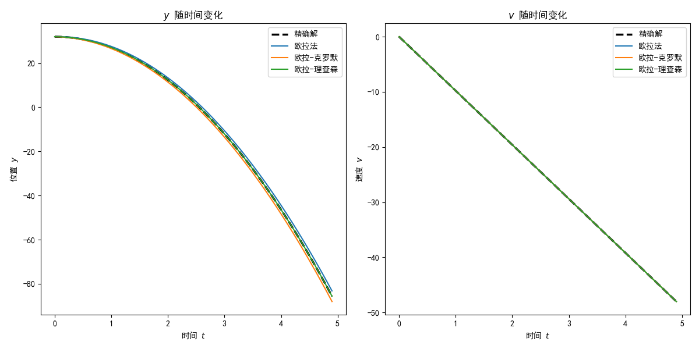
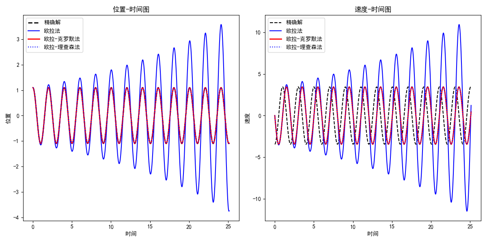
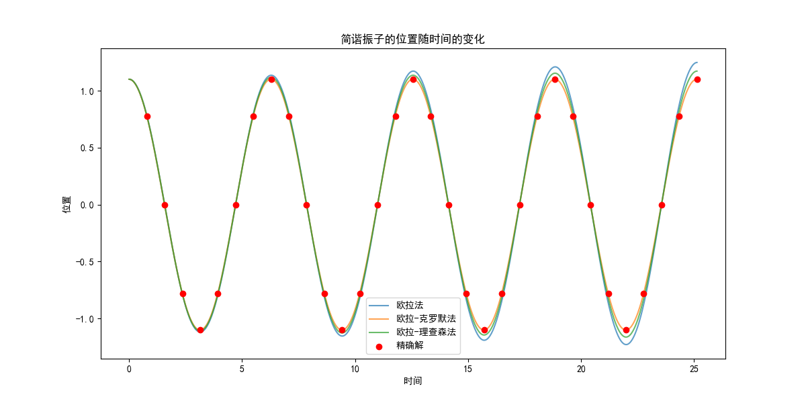
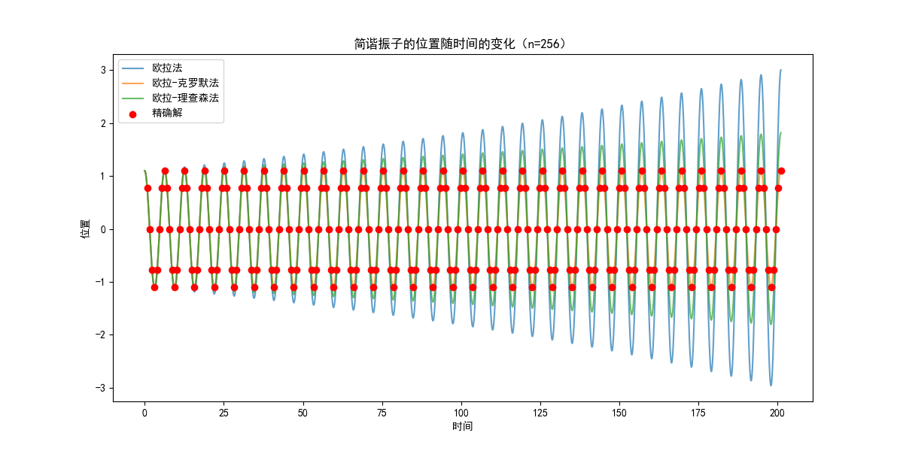
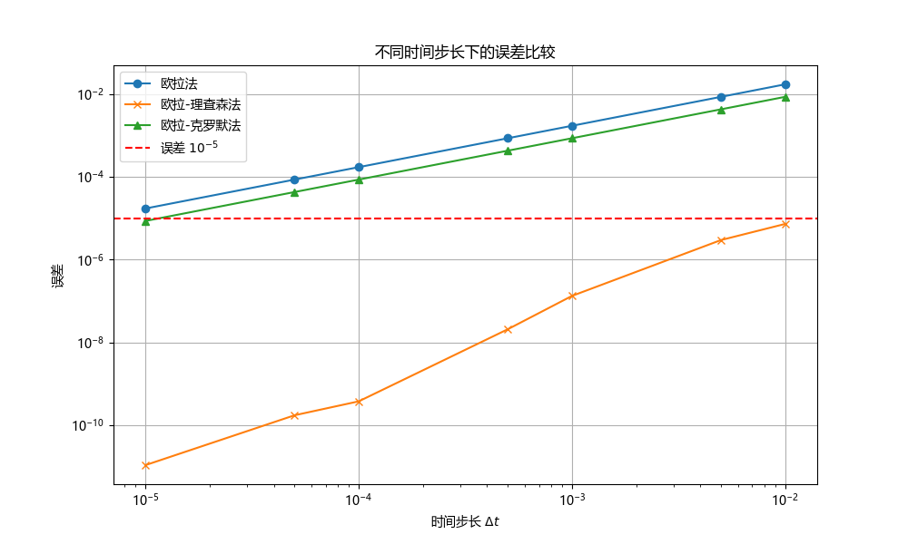

# <center>Comparison of algorithm

## (a)算法比较

> 使用你的程序来确定在地球表面附近自由落体的速度和位置的时间依赖性。假设在$t = 0\text{s}$时，$y = 32\text{m}$，$v = 0$。坐标系统显示在第3讲的第8页PPT中（$y$轴向上，重力向下）。将你的输出与精确结果$v = v_0 − gt$，$y(t) = y_0 + v_0t − \frac{1}{2}gt^2$进行比较。为了达到$10^5$的精度，对于欧拉、欧拉-克罗默和欧拉-理查森算法，$\Delta t$的合适值是多少？（制作一个比较表）
> 

描述自由落体的微分方程是牛顿第二定律

$$
\frac{\mathrm{d}^2 y(t)}{\mathrm{d}t^2} = -g
$$

为了使用模拟在$t = 0\text{s}$时，$y = 32\text{m}$，$v = 0$条件下的运动，引入如下库依赖

```{.python .copy}
import numpy as np
import pandas as pd
```

定义物理常量

```{.python .copy}
g = 9.8   # 重力加速度
y0 = 32   # 初始高度
v0 = 0    # 初始速度

```

考虑比较算法的精确性的目的，定义精确解函数为

```{.python .copy}
def exact_solution(t):
    y_exact = y0 + v0 * t - 0.5 * g * t**2
    v_exact = v0 - g * t
    return y_exact, v_exact
```

再定义三个算法下的求解函数，欧拉算法求解函数为

```{.python .copy}
def euler(y, v, dt):
    y_new = y + v * dt
    v_new = v - g * dt
    return y_new, v_new
```

欧拉-克罗默算法求解函数为

```{.python .copy}
def euler_cromer(y, v, dt):
    v_new = v - g * dt
    y_new = y + v_new * dt
    return y_new, v_new
```

欧拉-理查森算法的求解函数为

```{.python .copy}
def euler_richardson(y, v, dt):
    v_half = v - 0.5 * g * dt
    y_new = y + v_half * dt
    v_new = v - g * dt
    return y_new, v_new
```

然后，在特定时间步长$\Delta t$下分别用三种数值方法进行求解，并与精确解比较以得到误差精度。为了实现程序的模块化，将求解过程封装为

```{.python .copy}
def integrate(method, dt, t_values):
    y_values = np.zeros_like(t_values)
    v_values = np.zeros_like(t_values)
    y_values[0] = y0
    v_values[0] = v0

    for i in range(1, len(t_values)):
        y_values[i], v_values[i] = method(y_values[i-1], v_values[i-1], dt)

    return y_values, v_values
```

将比较过程封装为

```{.python .copy}
def compare_accuracy(dt_values):
    results = {method.__name__: [] for method in [euler, euler_cromer, euler_richardson]}
    
    for dt in dt_values:
        t_values = np.arange(0, 5, dt)
        y_exact, v_exact = exact_solution(t_values)

        for method in [euler, euler_cromer, euler_richardson]:
            y, v = integrate(method, dt, t_values)
            error_y = np.max(np.abs(y - y_exact))  # 计算位置的最大误差
            error_v = np.max(np.abs(v - v_exact))  # 计算速度的最大误差
            results[method.__name__].append((error_y, error_v))
    
    return pd.DataFrame(results, index=dt_values)

```

其中使用了`pd.DataFrame`来将误差计算结果封装。为了使输出结果更易读，定义结果格式化函数

```{.python .copy}
def format_results(df):
    formatted_df = pd.DataFrame()

    for method in df.columns:
        formatted_df[method + '_y_error'] = df[method].apply(lambda x: x[0])
        formatted_df[method + '_v_error'] = df[method].apply(lambda x: x[1])

    return formatted_df
```

现在，执行计算，考虑四个时间步长

```{.python .copy}
dt_values = [0.1, 0.01, 0.001, 0.0001]
```

执行精度比较

```{.python .copy}
accuracy_comparison = compare_accuracy(dt_values)
```

格式化比较结果

```{.python .copy}
formatted_accuracy_comparison = format_results(accuracy_comparison)
```

使用`print(formatted_accuracy_comparison)`输出结果，输出为

```
             euler  euler_cromer  euler_richardson
0.100000  2.401000      2.401000      2.842171e-14
0.010000  0.244510      0.244510      4.263256e-13
0.001000  0.024495      0.024495      7.560175e-12
0.000100  0.002450      0.002450      7.750600e-11
0.000010  0.000245      0.000245      6.165806e-10
0.000001  0.000024      0.000025      7.146085e-09
```

即三个算法相对精确解的误差如下

| $\Delta t$ | 欧拉法$y$误差 | 欧拉-克罗默$y$误差 | 欧拉-理查森$y$误差 |
|------------|---------------------|-------------------------|-------------------------|
| 0.100000   | 2.401000            | 2.401000                | 2.842171e-14            |
| 0.010000   | 0.244510            | 0.244510                | 4.263256e-13            |
| 0.001000   | 0.024495            | 0.024495                | 7.560175e-12            |
| 0.000100   | 0.002450            | 0.002450                | 7.750600e-11            |
| 0.000010   | 0.000245            | 0.000245                | 6.165806e-10            |
| 0.000001   | 0.000024            | 0.000025                | 7.146085e-09            |

可以看出，从位置来看，欧拉法和欧拉-克拉默法的误差是一样的，且时间步长的减小为原来的$1/10$，误差也减小为原来的$1/10$，直到$\Delta t=0.000001\text{s}$时，精度达到了$10^{-5}$量级。然而，欧拉-理查森算法虽然具有很高的精度，但其误差却越来越大。因此，就$10^{-5}$量级来说，欧拉法和欧拉-克罗默算法的合适时间步长是$\Delta t=0.000001\text{s}$，对于欧拉-理查森算法，只需选择计算量小的$\Delta t=0.1\text{s}$，或者更大的时间步长，即可得到结果。

## (b)可视化

>  使用任何图形工具绘制下落物体的$y$和$v$作为时间的函数
>  

使用如下库依赖实现中文绘图

```{.python .copy}
import matplotlib.pyplot as plt
import matplotlib
matplotlib.rcParams['font.sans-serif'] = ['SimHei']
matplotlib.rcParams['font.family'] = 'sans-serif'
```

为了凸显不同算法的差异，设置时间步长为$\Delta t=0.1\text{s}$

```{.python .copy}
dt = 0.1
t_values = np.arange(0, 5, dt)
```

在上述定义的求解函数下，使用不同方法积分

```{.python .copy}
y_exact, v_exact = exact_solution(t_values)
y_euler, v_euler = integrate(euler, dt, t_values)
y_cromer, v_cromer = integrate(euler_cromer, dt, t_values)
y_richardson, v_richardson = integrate(euler_richardson, dt, t_values)
```

分别绘制$y-t$图

```{.python .copy}
plt.figure(figsize=(12, 6))
plt.subplot(1, 2, 1)
plt.plot(t_values, y_exact, label="精确解", linestyle='dashed', linewidth=2.5, color='black')
plt.plot(t_values, y_euler, label="欧拉法")
plt.plot(t_values, y_cromer, label="欧拉-克罗默")
plt.plot(t_values, y_richardson, label="欧拉-理查森")
plt.title("$y$ 随时间变化")
plt.xlabel("时间 $t$")
plt.ylabel("位置 $y$")
plt.legend()
```

和$v-t$图

```{.python .copy}
plt.subplot(1, 2, 2)
plt.plot(t_values, v_exact, label="精确解", linestyle='dashed', linewidth=2.5, color='black')
plt.plot(t_values, v_euler, label="欧拉法")
plt.plot(t_values, v_cromer, label="欧拉-克罗默")
plt.plot(t_values, v_richardson, label="欧拉-理查森")
plt.title("$v$ 随时间变化")
plt.xlabel("时间 $t$")
plt.ylabel("速度 $v$")
plt.legend()
```

显示图表

```{.python .copy}
plt.tight_layout()
plt.show()
```

输出为



可以看出，欧拉-理查森算法具有相当的精度。


## (c)简谐振子

> 将你的程序应用于简谐振子，其受力$F = −kx$，取单位使得$k = 1$和$m = 1$。假设$x(t = 0) = 1.1$和$v(t = 0) = 0.0$，使用这三种算法确定$x(t)$，并将其与在$t = n\pi/4，n = 1, 2, \cdots , 32$时的精确结果进行比较。（我希望你还记得如何得到它）如果运行更长时间，比如$n = 256$，或$512$会发生什么？尝试不同的$\Delta t$值，以便与在$t = \pi$时的精确解相比精度达到$10^5$
> 

简谐振子的微分方程为

$$
m\frac{\mathrm{d}^2 x}{\mathrm{d}t^2} = -kx
$$

取单位使得$k = 1$和$m = 1$，则

$$
\frac{\mathrm{d}^2 x}{\mathrm{d}t^2} = -x
$$

其精确解为

$$
x(t) = x_0 \cos t + \frac{v_0}{\omega}\sin t
$$

在本题中$x_0=1.1$且$v_0=0$，故精确解为

$$
x(t) = 1.1\cos t
$$

采用上述三种数值方法求解，过程是

- 欧拉法：$v_{n+1}=v_n - x_n\Delta t$和$x_{n+1}=x_n + v_n\Delta t$
- 欧拉-克拉默法：$v_{n+1}=v_n - x_n\Delta t$和$x_{n+1}=x_n+v_{n+1}\Delta t$
- 欧拉-理查森法：$v_{1/2}=v_n-x_n(\Delta t/2)$和$x_{n+1}=x_n+v_{1/2}\Delta t$和$v_{n+1}=v_n - x_{n+1}\Delta t$

现在来实现这些方法，在前面程序的基础上，只需改写算法函数为

欧拉法

```{.python .copy}
def euler(x, v, dt):
    dxdt = v
    dvdt = -omega**2 * x
    x_new = x + dxdt * dt
    v_new = v + dvdt * dt
    return x_new, v_new
```

欧拉-克罗默法

```{.python .copy}
def euler_cromer(x, v, dt):
    dvdt = -omega**2 * x
    v_new = v + dvdt * dt
    x_new = x + v_new * dt
    return x_new, v_new
```

欧拉-理查森法

```{.python .copy}
def euler_richardson(x, v, dt):
    dxdt = v
    dvdt = -omega**2 * x
    x_mid = x + dxdt * dt / 2
    v_mid = v + dvdt * dt / 2
    dxdt_mid = v_mid
    dvdt_mid = -omega**2 * x_mid
    x_new = x + dxdt_mid * dt
    v_new = v + dvdt_mid * dt
    return x_new, v_new
```

然后求解函数模块化为

```{.python .copy}
def integrate(method, y0, v0, dt, t_end):
    t = np.arange(0, t_end, dt)
    y = np.zeros(len(t))
    v = np.zeros(len(t))
    y[0], v[0] = y0, v0

    for i in range(1, len(t)):
        y[i], v[i] = method(y[i-1], v[i-1], dt)

    return t, y, v
```

即可求解。选定时间范围和步长如下

```{.python .copy}
t_end = 8 * np.pi
dt = 0.01
```

用三种方法求解方程

```{.python .copy}
t_euler, y_euler, v_euler = integrate(euler, y0, v0, dt, t_end)
t_cromer, y_cromer, v_cromer = integrate(euler_cromer, y0, v0, dt, t_end)
t_richardson, y_richardson, v_richardson = integrate(euler_richardson, y0, v0, dt, t_end)
```

再定义精确解

```{.python .copy}
t_exact = np.linspace(0, t_end, 1000)
y_exact = exact_solution(t_exact)
```

使用如下函数绘图即可

```{.python .copy}
plt.figure(figsize=(12, 6))

# 位置-时间图
plt.subplot(1, 2, 1)
plt.plot(t_exact, y_exact, label='精确解', linestyle='--', linewidth=2, color='black')
plt.plot(t_euler, y_euler, label='欧拉法', color='blue')
plt.plot(t_cromer, y_cromer, label='欧拉-克罗默法', linestyle='-', linewidth=2, color='red')
plt.plot(t_richardson, y_richardson, label='欧拉-理查森法', linestyle=':', color='blue')
plt.xlabel('时间')
plt.ylabel('位置')
plt.title('位置-时间图')
plt.legend()

# 速度-时间图
plt.subplot(1, 2, 2)
plt.plot(t_exact, -y_exact * omega, label='精确解', linestyle='--', color='black')
plt.plot(t_euler, v_euler, label='欧拉法', color='blue')
plt.plot(t_cromer, v_cromer, label='欧拉-克罗默法', linestyle='-', linewidth=2, color='red')
plt.plot(t_richardson, v_richardson, label='欧拉-理查森法', linestyle=':', color='blue')
plt.xlabel('时间')
plt.ylabel('速度')
plt.title('速度-时间图')
plt.legend()

plt.tight_layout()
plt.show()
```

输出为



可以看出欧拉法效果最差，另两个模拟效果较为相近。

将数值解出的$x(t)$与在$t = n\pi/4，n = 1, 2, \cdots , 32$时的精确结果进行比较，结果为



尝试更大的$n$，如$n=256$，结果为



可见误差越来越大。

在前述算法的基础上，定义误差函数

```{.python .copy}
def error_at_pi(method, dt):
    times, x_values = integrate(method, dt, np.pi)
    x_numeric_at_pi = x_values[-1]
    x_exact_at_pi = exact_solution_shm(np.pi)
    error = np.abs(x_exact_at_pi - x_numeric_at_pi)
    return error
```

设置一系列时间步长

```{.python .copy}
dt_values = [0.01, 0.005, 0.001, 0.0005, 0.0001, 0.00005, 0.00001]
```

记录每个时间步长下的误差

```{.python .copy}
errors_euler = [error_at_pi(euler_shm, dt) for dt in dt_values]
errors_cromer = [error_at_pi(euler_cromer_shm, dt) for dt in dt_values]
errors_richardson = [error_at_pi(euler_richardson_shm, dt) for dt in dt_values]
```

用如下代码将各个算法在不同时间步长下的误差可视化

```{.python .copy}
plt.figure(figsize=(10, 6))
plt.plot(dt_values, errors_euler, label='欧拉法', marker='o')
plt.plot(dt_values, errors_cromer, label='欧拉-克罗默法', marker='x')
plt.plot(dt_values, errors_richardson, label='欧拉-理查森法', marker='^')
plt.axhline(y=1e-5, color='r', linestyle='--', label='误差 $10^{-5}$')
plt.xscale('log')
plt.yscale('log')
plt.xlabel('时间步长 $\Delta t$')
plt.ylabel('误差')
plt.title('不同时间步长下的误差比较')
plt.legend()
plt.grid(True)
plt.show()
```

输出为



可见各个算法将误差降到$10^{-5}$量级所需的时间步长。

## (d)算法优化

> 从你的模拟结果来看，欧拉-克罗默算法是否比欧拉算法更好？想一种简单的修改，要么是欧拉算法，要么是克罗默算法，以获得对于无空气阻力的自由落体情况的精确结果
> 

从自由落体问题看，两者差别不大；从简谐振动问题来看，欧拉-克罗默算法明显稳定性更强。因此我认为欧拉-克罗默算法比较好。针对无空气阻力自由落体问题，欧拉法相当于将

$$
\begin{aligned}
y(t_{n+1}) &= y(t_n+\Delta t) = v_0(t_n+\Delta t) + \frac{1}{2}g(t_n+\Delta t)^2\\
&=y(t_n) + v_0\Delta t + gt_n\Delta t + \frac{1}{2}g (\Delta t)^2\\
&\approx y(t_n) + v_0\Delta t + gt_n\Delta t + o(\Delta t)
\end{aligned}
$$

要提高精度，只需把二阶项补上，其实现为

```{.python .copy}
def improved_euler_fall(y, v, dt, g):
    v_new = v + g * dt
    y_new = y + v * dt + 0.5 * g * (dt**2)
    return y_new, v_new
```

`y_new`是通过在原有的欧拉法基础上添加二阶项得到的。