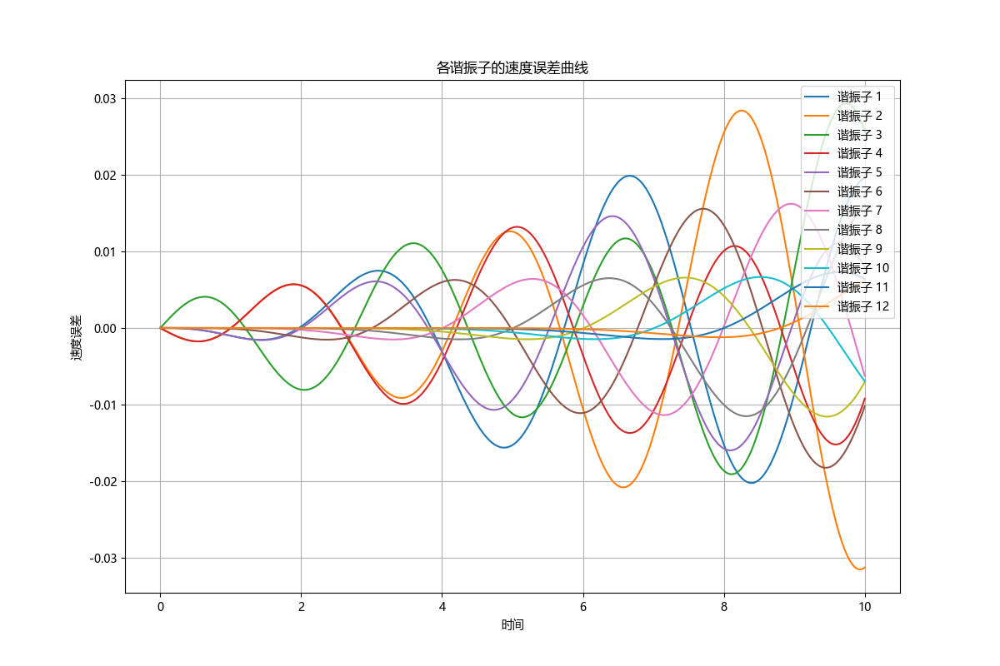
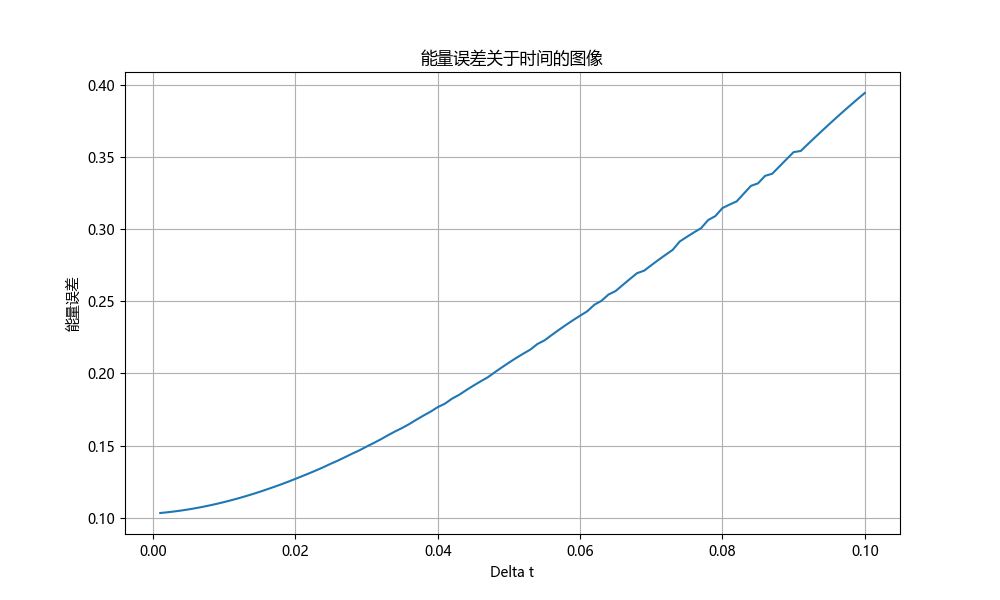
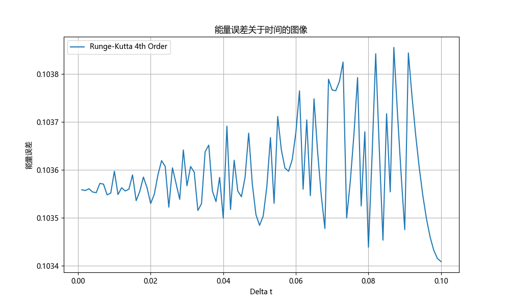

# <center>耦合谐振子

> 使用与谐振子类似的程序解$N = 12$个谐振子的动力学运动方程，初始条件为$u_j(t = 0) = 0$和$v_3(t = 0) =1$。将$u_j(t)$的数值结果与解析结果进行比较。

运动方程为

$$
M\frac{\mathrm{d}^2 u_j(t)}{\mathrm{d} t^2} = -K[2u_j(t) - u_{j+1}(t) - u_{j-1}(t)]
$$

课件中已经给出，问题的解是

$$
u_j(t) = \frac{2}{N+1}\sum_{n=1}^{N} \frac{1}{\omega_n} \cos(\omega_n t) \sin (q_n a)\sin (q_n ja)
$$


## (a)欧拉法-理查森法速度的最大误差

> $u_j(t)$的最大误差是多少

首先导入所需的库

```{.python .copy}
import numpy as np
import matplotlib.pyplot as plt

import matplotlib
# 设置字体为Microsoft YaHei
matplotlib.rcParams['font.sans-serif'] = ['Microsoft YaHei']
matplotlib.rcParams['font.family'] = 'sans-serif'
plt.rcParams['axes.unicode_minus'] = False
```

定义物理量

```{.python .copy}
k = 1
m = 1
n = 12
delta_time = 0.01
time_max = 10
```

初始化时间和速度数组

```{.python .copy}
u = np.zeros(n + 2)
v = np.zeros(n + 2)
v[3] = 1
t_values = np.arange(0, time_max + delta_time, delta_time)
u_values = np.zeros((n + 2, int(time_max / delta_time) + 1))
v_values = np.zeros((n + 2, int(time_max / delta_time) + 1))
u_values[:, 0] = 0
v_values[3, 0] = v[3] = 1
```

定义运动方程

```{.python .copy}
def sho(u, v, k, m, delta_time, n):
    a = np.zeros(n + 2)
    for i in range(1, n + 1):
        a[i] = k / m * (u[i+1] + u[i-1] - 2*u[i])
    u_next = u + v * delta_time + 0.5 * a * delta_time ** 2
    v_next = v + a * delta_time
    return u_next, v_next
```

定义解析解

```{.python .copy}
q_n = np.pi * np.arange(1, N + 1) / (N + 1)  # mode wave numbers
omega_n = np.sqrt(4 * K / M * np.sin(q_n * a / 2)**2)  # mode frequencies
u_analytical = np.zeros_like(u)

for j in range(N):
    for n in range(N):
        u_analytical[:, j] += 2 / (N + 1) * 1 / omega_n[n] * np.cos(omega_n[n] * t) * np.sin(q_n[n] * a) * np.sin(q_n[n] * j * a)
```

计算解析解

```{.python .copy}
u_analytic = np.zeros((n, len(t_values)))
v_analytic = np.zeros((n, len(t_values)))
for j in range(n):
    for t_idx, t in enumerate(t_values):
        u_analytic[j, t_idx], v_analytic[j, t_idx] = analytic_solution(j+1, n, t)
```

计算数值解

```{.python .copy}
for i in range(int(time_max / delta_time)):
    u_values[:, i+1], v_values[:, i+1] = sho(u_values[:, i], v_values[:, i], k, m, delta_time, n)
```

求出每个谐振子的速度误差曲线为

```{.python .copy}
velocity_errors = v_values - v_analytic
plt.figure(figsize=(12, 8))
for j in range(n):
    plt.plot(t_values, velocity_errors[j, :], label=f'谐振子 {j+1}')

plt.xlabel('时间')
plt.ylabel('速度误差')
plt.title('各谐振子的速度误差曲线')
plt.legend(loc='upper right')
plt.grid(True)
plt.show()
```

输出为



计算并打印最大误差

```{.python .copy}
max_velocity_errors = np.max(np.abs(velocity_errors), axis=1)

for i in range(n):
    print(f'{i+1}: {max_velocity_errors[i]:.3f}')
```

输出为
```
1: 0.020
2: 0.032
3: 0.029
4: 0.015
5: 0.016
6: 0.018
7: 0.016
8: 0.016
9: 0.012
10: 0.007
11: 0.007
12: 0.006
```

## (b) 欧拉法-理查森法能量误差曲线

> 总能量作为$\Delta t$函数保持得有多好？


在上述代码下面补充如下代码，显示出能量关于时间的变化，可见能量误差逐渐增大

```{.python .copy}
def total_energy(u, v, k, m, n):
    """Calculate the total energy of the system."""
    kinetic_energy = 0.5 * m * np.sum(v[1:-1]**2, axis=0)
    potential_energy = 0.5 * k * np.sum((u[2:] - u[1:-1])**2, axis=0)
    return kinetic_energy + potential_energy

# Time steps to test
delta_ts = np.linspace(0.001, 0.1, 100)
energy_errors = []

for delta_t in delta_ts:
    time_steps = int(time_max / delta_t)

    # Reinitialize u and v for each delta_t
    u = np.zeros((n + 2, time_steps + 1))
    v = np.zeros((n + 2, time_steps + 1))
    v[3, 0] = 1

    # Calculate the system's behavior over time
    for i in range(time_steps):
        u[:, i + 1], v[:, i + 1] = sho(u[:, i], v[:, i], k, m, delta_t, n)

    # Calculate the total energy of the system
    energies = total_energy(u, v, k, m, n)
    energy_error = np.std(energies) / np.mean(energies)  # Relative energy fluctuation
    energy_errors.append(energy_error)

# Plotting the energy error as a function of delta_t
plt.figure(figsize=(10, 6))
plt.plot(delta_ts, energy_errors)
plt.xlabel('Delta t')
plt.ylabel('能量误差')
plt.title('能量误差关于时间的图像')
plt.grid(True)
plt.show()
```

图像为




## (c) 四阶龙格-库塔算法误差曲线

> 如果使用四阶龙格-库塔算法，总能量作为$\Delta t$的函数保持得有多好？

在上述代码下方定义荣格库塔法，重新计算绘图即可

```{.python .copy}
def runge_kutta_4th(u, v, k, m, delta_t, n):
    """Fourth-order Runge-Kutta method for the system."""
    a1 = k / m * (np.roll(u, -1) + np.roll(u, 1) - 2 * u)
    u1 = u + v * delta_t / 2
    v1 = v + a1 * delta_t / 2

    a2 = k / m * (np.roll(u1, -1) + np.roll(u1, 1) - 2 * u1)
    u2 = u + v1 * delta_t / 2
    v2 = v + a2 * delta_t / 2

    a3 = k / m * (np.roll(u2, -1) + np.roll(u2, 1) - 2 * u2)
    u3 = u + v2 * delta_t
    v3 = v + a3 * delta_t

    a4 = k / m * (np.roll(u3, -1) + np.roll(u3, 1) - 2 * u3)

    u_next = u + delta_t / 6 * (v + 2 * v1 + 2 * v2 + v3)
    v_next = v + delta_t / 6 * (a1 + 2 * a2 + 2 * a3 + a4)
    return u_next, v_next

energy_errors_rk = []

for delta_t in delta_ts:
    time_steps = int(time_max / delta_t)

    # Reinitialize u and v for each delta_t
    u = np.zeros((n + 2, time_steps + 1))
    v = np.zeros((n + 2, time_steps + 1))
    v[3, 0] = 1

    # Calculate the system's behavior over time using Runge-Kutta 4th order method
    for i in range(time_steps):
        u[:, i + 1], v[:, i + 1] = runge_kutta_4th(u[:, i], v[:, i], k, m, delta_t, n)

    # Calculate the total energy of the system
    energies = total_energy(u, v, k, m, n)
    energy_error = np.std(energies) / np.mean(energies)  # Relative energy fluctuation
    energy_errors_rk.append(energy_error)

# Plotting the energy error as a function of delta_t for Runge-Kutta 4th order method
plt.figure(figsize=(10, 6))
plt.plot(delta_ts, energy_errors_rk, label='Runge-Kutta 4th Order')
plt.xlabel('Delta t')
plt.ylabel('能量误差')
plt.title('能量误差关于时间的图像')
plt.grid(True)
plt.legend()
plt.show()
```

输出为



从纵坐标可见误差小的多，且比较稳定，不会误差越来越大。