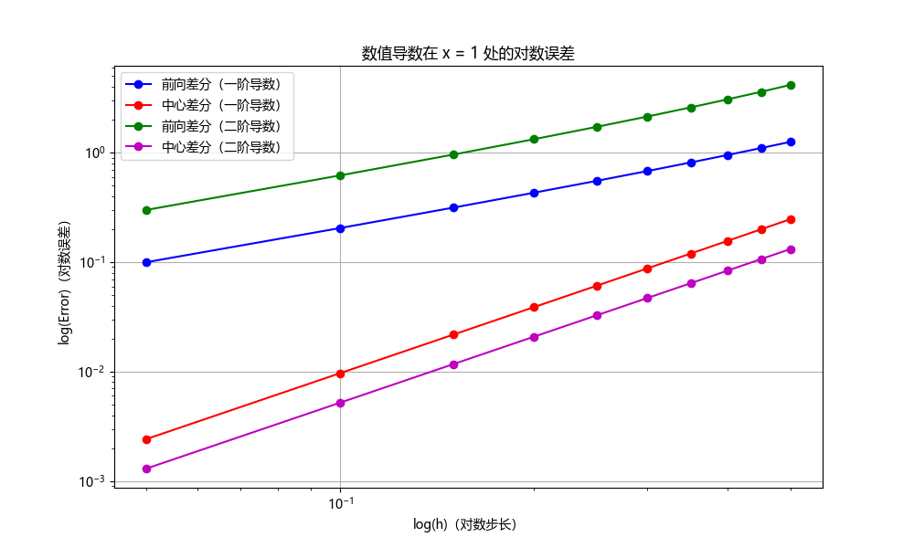

# <center>求导数

## (a)前向差分和中心差分

> 考虑函数$f(x) = x\cosh(x)$在$x = 1$时的一阶和二阶导数。当$h = 0.50, 0.45,\cdots, 0.05$时，使用前向差分和中心差分公式进行计算。绘制对数误差与对数$h$的关系图。将你的结果与理查森外推法的结果进行比较。

前向差分的数值计算公式为

$$
f^{\prime}(x) = \frac{f(x+h) - f(x)}{h} + O(h)
$$

再进行一次前向差分即得到二阶导的数值计算公式

$$
f^{\prime\prime}(x) = \frac{f(x+2h)-2f(x+h)+f(x)}{h^2} + O(h)
$$

中心差分的数值计算公式为

$$
f^{\prime}(x) = \frac{f(x+h) - f(x-h)}{2h} + O(h^2)
$$

再进行一次中心差分即得到二阶导的数值计算公式

$$
f^{\prime\prime}(x) = \frac{f(x+h)-2f(x)+f(x-h)}{h^2} + O(h^2)
$$

使用`python`实现上述计算，首先引入必要的库

```{.python .copy}
import numpy as np
import matplotlib.pyplot as plt

import matplotlib
# 设置字体为Microsoft YaHei
matplotlib.rcParams['font.sans-serif'] = ['Microsoft YaHei']
matplotlib.rcParams['font.family'] = 'sans-serif'
plt.rcParams['axes.unicode_minus'] = False
```

其中`matplotlib`库用来实现图片中的中文字体显示，然后定义待求函数

```{.python .copy}
def f(x):
    return x * np.cosh(x)
```

定义前向差分的一阶导和二阶导

```{.python .copy}
def forward_difference(f, x, h):
    return (f(x + h) - f(x)) / h
def forward_difference_2nd(f, x, h):
    return (f(x + 2*h) - 2*f(x + h) + f(x)) / h**2
```

定义中心差分的一阶导和二阶导

```{.python .copy}
def centered_difference(f, x, h):
    return (f(x + h) - f(x - h)) / (2 * h)
def centered_difference_2nd(f, x, h):
    return (f(x + h) - 2*f(x) + f(x - h)) / h**2
```

为了比较误差，再定义导数的解析解

```{.python .copy}
def f_prime(x):
    return np.cosh(x) + x * np.sinh(x)
def f_double_prime(x):
    return 2 * np.sinh(x) + x * np.cosh(x)
```

由题意，考虑

```{.python .copy}
x0 = 1.0
```

处的导数，定义一系列区间长

```{.python .copy}
h_values = np.arange(0.05, 0.51, 0.05)
```

初始化存储误差的数组

```{.python .copy}
errors_forward_first = []
errors_centered_first = []
errors_forward_second = []
errors_centered_second = []
```

进行计算并记录误差

```{.python .copy}
for h in h_values:
    # First derivative
    error_forward_first = np.abs(f_prime(x0) - forward_difference(f, x0, h))
    error_centered_first = np.abs(f_prime(x0) - centered_difference(f, x0, h))
    errors_forward_first.append(error_forward_first)
    errors_centered_first.append(error_centered_first)

    # Second derivative
    error_forward_second = np.abs(f_double_prime(x0) - forward_difference_2nd(f, x0, h))
    error_centered_second = np.abs(f_double_prime(x0) - centered_difference_2nd(f, x0, h))
    errors_forward_second.append(error_forward_second)
    errors_centered_second.append(error_centered_second)
```

绘制误差图

```{.python .copy}
plt.figure(figsize=(10, 6))

plt.loglog(h_values, errors_forward_first, 'b-o', label='前向差分（一阶导数）')
plt.loglog(h_values, errors_centered_first, 'r-o', label='中心差分（一阶导数）')
plt.loglog(h_values, errors_forward_second, 'g-o', label='前向差分（二阶导数）')
plt.loglog(h_values, errors_centered_second, 'm-o', label='中心差分（二阶导数）')

plt.xlabel('log(h)（对数步长）')
plt.ylabel('log(Error)（对数误差）')
plt.title('数值导数在 x = 1 处的对数误差')
plt.legend()
plt.grid(True)

plt.show()
```

输出为



可见中心差分的两条线处于下方，这说明中心差分法的精度更高。

在$h=0.05$时，两种算法的计算结果如下

|                       |     前向差分法     |    中心差分法     | 解析解             |
| :-------------------: | :----------------: | :---------------: | ------------------ |
|    $f^{\prime}(x)$    | 2.8180704090254816 | 2.720700809506029 | 2.718281828459045  |
| $f^{\prime\prime}(x)$ |  4.19309339467615  | 3.894783980778093 | 3.8934830221028465 |

与解析解比较，也可以看出中心差分法的优势。

## (b)导数估算

> 使用二点、三点和五点公式估算$f(x)$在$x = 0$处的前五个导数。

$$
f(x) = \frac{e^x}{\sin^3(x) + \cos^3(x)}
$$

两点公式为

$$
f^{\prime}(x) = \frac{f(x+h)-f(x-h)}{2h} + O(h^2)
$$

三点公式为

$$
f^{\prime}(x) = \frac{-3f(x)+4f(x+h)-f(x+2h)}{2h} + O(h^2)
$$

五点公式为

$$
f^{\prime}(x) = \frac{-25f(x)+48f(x+h)-36f(x+2h)+16f(x+3h)-3f(x+4h)}{12h} + O(h^4)
$$

为了求五个导数，使用递归方式进行计算，为了实现递归，使用`sympy`进行计算，导入

```{.python .copy}
import sympy as sp
```

定义自变量和函数，并选定区间长度$h=1/2$

```{.python .copy}
x = sp.symbols('x')
f = sp.exp(x) / (sp.sin(x)**3 + sp.cos(x)**3)

h = 1/2
```

定义好上述三种数值计算公式

```{.python .copy}
f_prime_2p = (f.subs(x, x + h) - f.subs(x, x - h)) / (2 * h)

f_prime_3p = (-3 * f.subs(x, x) + 4 * f.subs(x, x + h) - f.subs(x, x + 2 * h)) / (2 * h)

f_prime_5p = (-25 * f.subs(x, x) + 48 * f.subs(x, x + h) - 36 * f.subs(x, x + 2 * h) + 16 * f.subs(x, x + 3 * h) - 3 * f.subs(x, x + 4 * h)) / (12 * h)
```

计算出$x=0$处函数的值

```{.python .copy}
f_prime_2p_at_0 = f_prime_2p.subs(x, 0).evalf()
f_prime_3p_at_0 = f_prime_3p.subs(x, 0).evalf()
f_prime_5p_at_0 = f_prime_5p.subs(x, 0).evalf()

f_prime_2p_at_0, f_prime_3p_at_0, f_prime_5p_at_0
```

其中`f.sub(x,x0)`的作用是将$x=x_0$代入$f(x)$。定义数值微分函数

```{.python .copy}
def numerical_derivative(formula, f, x_val, order, h=1/2):
    if order == 0:
        return f.subs(x, x_val).evalf()
    elif formula == '2p':
        return (numerical_derivative(formula, f, x_val + h, order - 1) - numerical_derivative(formula, f, x_val - h, order - 1)) / (2 * h)
    elif formula == '3p':
        return (-3 * numerical_derivative(formula, f, x_val, order - 1) + 4 * numerical_derivative(formula, f, x_val + h, order - 1) - numerical_derivative(formula, f, x_val + 2 * h, order - 1)) / (2 * h)
    elif formula == '5p':
        return (-25 * numerical_derivative(formula, f, x_val, order - 1) + 48 * numerical_derivative(formula, f, x_val + h, order - 1) - 36 * numerical_derivative(formula, f, x_val + 2 * h, order - 1) + 16 * numerical_derivative(formula, f, x_val + 3 * h, order - 1) - 3 * numerical_derivative(formula, f, x_val + 4 * h, order - 1)) / (12 * h)
```

计算数值微分并打印出结果

```{.python .copy}
derivatives_2p = [numerical_derivative('2p', f, 0, i) for i in range(1, 6)]
derivatives_3p = [numerical_derivative('3p', f, 0, i) for i in range(1, 6)]
derivatives_5p = [numerical_derivative('5p', f, 0, i) for i in range(1, 6)]

print(derivatives_2p, derivatives_3p, derivatives_5p)
```

输出为

```
[1.02520888790112, 0.767566420814180, 1.66319777845131, 5.63557668212560, -53.9587012001399]
[1.78243544510891, 12.7807404146464, -889.817102895411, 21441.3146533666, -274979.895333829]
[-2.42887448547971, 2091.50909425478, 25825.5101162839, -79668571.5208342, 8963687648.42747]
```

即计算结果为

|              | 两点法            | 三点法            | 四点法            |
| ------------ | ----------------- | ----------------- | ----------------- |
| $f^{(1)}(x)$ | 1.02520888790112  | 1.78243544510891  | -2.42887448547971 |
| $f^{(2)}(x)$ | 0.767566420814180 | 12.7807404146464  | 2091.50909425478  |
| $f^{(3)}(x)$ | 1.66319777845131  | -889.817102895411 | 25825.5101162839  |
| $f^{(4)}(x)$ | 5.63557668212560  | 21441.3146533666  | -79668571.5208342 |
| $f^{(5)}(x)$ | -53.9587012001399 | -274979.895333829 | 8963687648.42747  |

> 作为检验，找出整数$v$使得$f^{(v)}(x=0)=-164$，推荐尝试$h=1/2^{n}$

经尝试（改变上面代码里的$h$），当$h=1/2^7=1/128$时，可以明显看出$v=5$，为了报告简洁，下面只展示五阶导的随着精度增加的变化

|           | 两点法            | 三点法            | 四点法            |
| --------- | ----------------- | ----------------- | ----------------- |
| $h=1/2$   | -53.9587012001399 | -274979.895333829 | 8963687648.42747  |
| $h=1/4$   | 832.326261015043  | 13500.9702604902  | 874993821.374344  |
| $h=1/8$   | -515.831500617998 | 1544.22399322511  | -350540.071627955 |
| $h=1/16$  | -212.357845678449 | -83.1992623781989 | -174.921571695297 |
| $h=1/32$  | -175.155183893163 | -143.952286900952 | -163.783410527551 |
| $h=1/64$  | -166.737819869071 | -158.792309030890 | -163.970800751389 |
| $h=1/128$ | -164.681361675262 | -162.663984537125 | -163.664322812401 |

即$v=5$为所求。