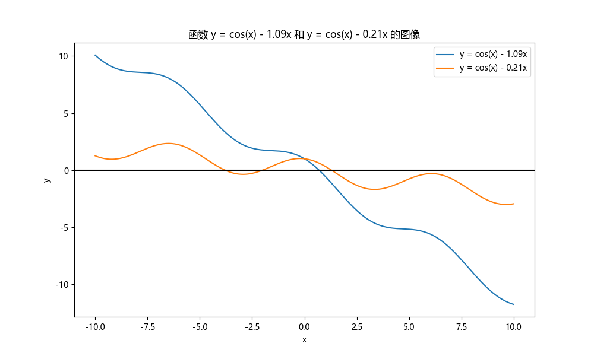

# 求根

## (a) 图解法

> 画出函数图像，判断根的个数，估计根的位置

首先导入所需的库

```{.python .copy}
import numpy as np
import matplotlib.pyplot as plt

import matplotlib
# 设置字体为Microsoft YaHei
matplotlib.rcParams['font.sans-serif'] = ['Microsoft YaHei']
matplotlib.rcParams['font.family'] = 'sans-serif'
plt.rcParams['axes.unicode_minus'] = False
```

定义常数

```{.python .copy}
a1 = 1.09
a2 = 0.21
```

定义两个函数

```{.python .copy}
x = np.linspace(-10, 10, 400)
y1 = np.cos(x) - a1 * x
y2 = np.cos(x) - a2 * x
```

画图

```{.python .copy}
plt.figure(figsize=(10, 6))
plt.plot(x, y1, label="y = cos(x) - 1.09x")
plt.plot(x, y2, label="y = cos(x) - 0.21x")
plt.axhline(0, color='black', linewidth=1.5)  # Highlight y=0 line
plt.xlabel('x')
plt.ylabel('y')
plt.title('函数 y = cos(x) - 1.09x 和 y = cos(x) - 0.21x 的图像')
plt.legend()
plt.show()
```

输出为



在`python`的输出框中，将鼠标移动到图上可以显示点的坐标，可以大致看出$y=\cos(x)-1.09x$的零点位置为$x=0.7$附近，而$y=\cos(x)-0.21x$的零点位置为$x=-3.8,-2,1.3$附近，根的个数分别为一个和三个。


## (b) 二分法

定义二分法函数

```{.python .copy}
def find_zeros_bisection(x, y, ai, precision=1e-5):
    """
    Find zeros of a function using bisection method.
    """
    zeros = []
    iteration_counts = []  # Store the number of iterations for each zero
    for i in range(len(y) - 1):
        if y[i] * y[i + 1] < 0:
            # There is a root between x[i] and x[i+1]
            low = x[i]
            high = x[i + 1]
            iterations = 0
            while high - low > precision:
                mid = (low + high) / 2
                if y[i] * ( np.cos(mid) - ai * mid ) > 0:  # 这说明零点在中点的右侧
                    low = mid
                else:
                    high = mid
                iterations += 1
            zeros.append((low + high) / 2)
            iteration_counts.append(iterations)
    return zeros, iteration_counts
```

其中记录了迭代的次数，求根并打印出结果

```{.python .copy}
zeros_y1, iterations_y1 = find_zeros_bisection(x, y1, a1)
zeros_y2, iterations_y2 = find_zeros_bisection(x, y2, a2)

print(zeros_y1, iterations_y1, zeros_y2, iterations_y2)
```

在`precision=1e-5`时输出为

```
[0.7010599007283829] [13] [-3.7914090646538217, -2.0055173333724943, 1.295312867128759] [13, 13, 13]
```

即两个函数的四个根及其对应的迭代次数为

|    根    | 迭代次数 |
| :------: | :------: |
| 0.70106  |    13    |
| -3.79141 |    13    |
| -2.00552 |    13    |
| 1.29531  |    13    |

在`precision=1e-8`时输出为

```
[0.701062007057935] [23] [-3.7914078247577025, -2.0055191469073, 1.295309876439565] [23, 23, 23]
```

即两个函数的四个根及其对应的迭代次数为

|     根      | 迭代次数 |
| :---------: | :------: |
| 0.70106201  |    23    |
| -3.79140782 |    23    |
| -2.00551915 |    23    |
| 1.29530988  |    23    |


## (c) Newton-Raphson法

定义算法函数为

```{.python .copy}
def find_zeros_bisection_newton_raphson(func, deriv, initial_guess, precision=1e-5, max_iterations=1000):
    """
    Find a zero of the function 'func' using the Newton-Raphson method.
    'deriv' is the derivative of 'func'.
    'initial_guess' is the starting point for the search.
    'precision' is the stopping criterion for the search.
    'max_iterations' is the maximum number of iterations to perform.
    """
    x = initial_guess
    iterations = 0
    for _ in range(max_iterations):
        x_new = x - func(x) / deriv(x)
        iterations += 1
        if abs(x_new - x) < precision:
            return x_new, iterations
        x = x_new
    return x, iterations  # Return the last value and iterations if precision is not met
```

定义待求函数和其导数为

```{.python .copy}
def func1(x):
    return np.cos(x) - a1 * x

def deriv1(x):
    return -np.sin(x) - a1

def func2(x):
    return np.cos(x) - a2 * x

def deriv2(x):
    return -np.sin(x) - a2
```

初始化从(a)小问中看出的猜测解

```{.python .copy}
initial_guesses_y1 = [0.7]  # Adjust based on the graph
initial_guesses_y2 = [-3.8, -2, 1.3]  # Adjust based on the graph
```

求根并打印结果

```{.python .copy}
zeros_y1_newton_counts = [find_zeros_bisection_newton_raphson(func1, deriv1, guess) for guess in initial_guesses_y1]
zeros_y2_newton_counts = [find_zeros_bisection_newton_raphson(func2, deriv2, guess) for guess in initial_guesses_y2]

print(zeros_y1_newton_counts, zeros_y2_newton_counts)
```

在`precision=1e-5`时输出为

```
[(0.7010620097508276, 2)] [(-3.791407821872055, 3), (-2.005519149472373, 2), (1.2953098788595738, 2)]
```

即两个函数的四个根及其对应的迭代次数为

|    根    | 迭代次数 |
| :------: | :------: |
| 0.70106  |    2     |
| -3.79141 |    3     |
| -2.00552 |    2     |
| 1.29531  |    2     |

在`precision=1e-8`时输出为

```
[(0.7010620097508139, 3)] [(-3.791407821872055, 3), (-2.005519149497392, 3), (1.2953098788588366, 3)]
```

即两个函数的四个根及其对应的迭代次数为

|     根      | 迭代次数 |
| :---------: | :------: |
| 0.70106201  |    3     |
| -3.79140782 |    3     |
| -2.00551915 |    3     |
| 1.29530988  |    3     |

## (d) Secant法

定义算法函数为

```{.python .copy}
def find_zeros_secant_method(func, x0, x1, precision=1e-5, max_iterations=1000):
    """
    Find a zero of the function 'func' using the secant method.
    'x0' and 'x1' are the starting points for the search.
    'precision' is the stopping criterion for the search.
    'max_iterations' is the maximum number of iterations to perform.
    """
    iterations = 0
    for _ in range(max_iterations):
        f_x0 = func(x0)
        f_x1 = func(x1)
        if f_x1 - f_x0 == 0:  # Avoid division by zero
            return None, iterations
        x_new = x1 - f_x1 * (x1 - x0) / (f_x1 - f_x0)
        iterations += 1
        if abs(x_new - x1) < precision:
            return x_new, iterations
        x0, x1 = x1, x_new  # Update the points for the next iteration
    return x1, iterations  # Return the last value and iterations if precision is not met
```

定义猜测解为

```{.python .copy}
initial_guesses_y1_secant = [(0.6, 0.8)]  # Pairs of initial guesses
initial_guesses_y2_secant = [(-3.8, -3.5), (-2, -1.5), (1.2, 1.4)]
```

求解零点并打印

```{.python .copy}
zeros_y1_secant_counts = [find_zeros_secant_method(func1, *guess) for guess in initial_guesses_y1_secant]
zeros_y2_secant_counts = [find_zeros_secant_method(func2, *guess) for guess in initial_guesses_y2_secant]

print(zeros_y1_secant_counts, zeros_y2_secant_counts)
```

在`precision=1e-5`时输出为

```
[(0.7010620097505902, 4)] [(-3.791407821844775, 4), (-2.005519149497319, 4), (1.2953098788588342, 4)]
```

即两个函数的四个根及其对应的迭代次数为

|    根    | 迭代次数 |
| :------: | :------: |
| 0.70106  |    4     |
| -3.79141 |    4     |
| -2.00552 |    4     |
| 1.29531  |    4     |

在`precision=1e-8`时输出为

```
[(0.7010620097508139, 5)] [(-3.7914078218720553, 5), (-2.005519149497319, 4), (1.2953098788588342, 4)]
```

即两个函数的四个根及其对应的迭代次数为

|     根      | 迭代次数 |
| :---------: | :------: |
| 0.70106201  |    5     |
| -3.79140782 |    5     |
| -2.00551915 |    4     |
| 1.29530988  |    4     |

## (e) False position法

定义算法函数为

```{.python .copy}
def find_zeros_false_position_method(func, x0, x1, precision=1e-5, max_iterations=1000):
    """
    Find a zero of the function 'func' using the false position (regula falsi) method.
    'x0' and 'x1' are the starting points for the search.
    'precision' is the stopping criterion for the search.
    'max_iterations' is the maximum number of iterations to perform.
    """
    for _ in range(max_iterations):
        f_x0 = func(x0)
        f_x1 = func(x1)
        x_new = x1 - f_x1 * (x1 - x0) / (f_x1 - f_x0)  # Compute the false position
        f_x_new = func(x_new)

        if abs(f_x_new) < precision:  # Check if the function value is close to zero
            return x_new, _ + 1

        # Decide which side to replace
        if f_x0 * f_x_new < 0:
            x1 = x_new
        else:
            x0 = x_new

    return None, max_iterations  # No solution found within the maximum iterations
```

求解零点并打印

```{.python .copy}
zeros_y1_false_position_counts = [find_zeros_false_position_method(func1, *guess) for guess in initial_guesses_y1_secant]
zeros_y2_false_position_counts = [find_zeros_false_position_method(func2, *guess) for guess in initial_guesses_y2_secant]

print(zeros_y1_false_position_counts, zeros_y2_false_position_counts)
```

在`precision=1e-5`时输出为

```
[(0.701061062095532, 3)] [(-3.791401447881101, 2), (-2.0055155973214824, 3), (1.2953097519121357, 3)]
```

即两个函数的四个根及其对应的迭代次数为

|    根    | 迭代次数 |
| :------: | :------: |
| 0.70106  |    3     |
| -3.79141 |    2     |
| -2.00552 |    3     |
| 1.29531  |    3     |

在`precision=1e-8`时输出为

```
[(0.7010620093437724, 5)] [(-3.79140782176121, 4), (-2.0055191471920217, 6), (1.295309877522808, 4)]
```

即两个函数的四个根及其对应的迭代次数为

|     根      | 迭代次数 |
| :---------: | :------: |
| 0.70106201  |    5     |
| -3.79140782 |    5     |
| -2.00551915 |    6     |
| 1.29530988  |    4     |

## (f) Simple iteration scheme

定义算法函数为

```{.python .copy}
def find_zeros_simple_iteration(func, initial_guess, transform_func, precision=1e-8, max_iterations=10000000000000):
    """
    Find a zero of the function 'func' using a simple iteration scheme.
    'initial_guess' is the starting point for the search.
    'transform_func' is a transformation function to apply in each iteration.
    'precision' is the stopping criterion for the search.
    'max_iterations' is the maximum number of iterations to perform.
    """
    x = initial_guess
    for i in range(max_iterations):
        x_new = transform_func(x)
        if abs(x_new - x) < precision:
            return x_new, i + 1
        x = x_new
    return None, max_iterations  # No solution found within the maximum iterations
```

定义转换函数（作为求不动点的函数）为

```{.python .copy}
def transform_func1_stable(x):
    return np.cos(x) / a1

def transform_func2_stable(x):
    return np.cos(x) / a2
```

求解零点并打印

```{.python .copy}
zeros_y1_simple_iteration_stable = [find_zeros_simple_iteration(func1, guess, transform_func1_stable) for guess in initial_guesses_y1]
zeros_y2_simple_iteration_stable = [find_zeros_simple_iteration(func2, guess, transform_func2_stable) for guess in initial_guesses_y2]

print(zeros_y1_simple_iteration_stable, zeros_y2_simple_iteration_stable)
```

在`precision=1e-5`时输出为

```
[(0.7010653183224674, 11)] [(-3.7914087554225886, 1760916), (-2.0055293429003753, 220325), (1.2953033221800236, 2542671)]

```

即两个函数的四个根及其对应的迭代次数为

|    根    | 迭代次数 |
| :------: | :------: |
| 0.70106  |    11    |
| -3.79141 | 1760916  |
| -2.00552 |  220325  |
| 1.29531  | 2542671  |

在`precision=1e-8`时，即使使用`10000000000`次迭代，长时间运算后第二个函数的零点输出仍然是`None`，这是这个算法的缺陷。即使是第一个函数，也需要根据前面估计的零点位置小心调整预测的零点，才能得出结果。
