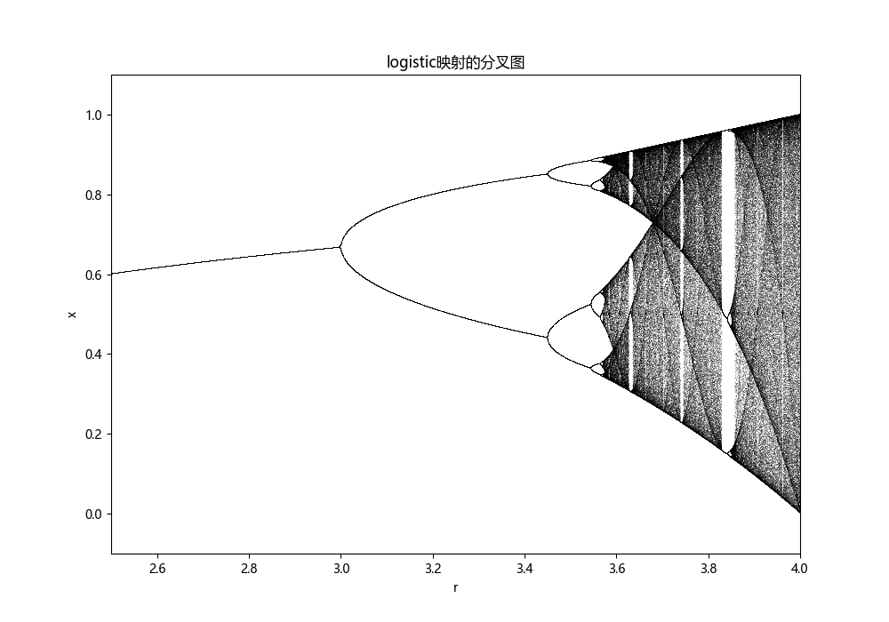

# 分叉图

> 生成如作业里的分叉图

对logistic映射

$$
f(x) = 4rx(1-x),\quad x\in [0,1]
$$

可验证它是一个压缩映射，从而Banach不动点定理保证了其只有一个不动点。对于每一个$r$，下面求出其经过$1000$次迭代后$x$的位置，以判断其稳定性

首先导入所需的库

```{.python .copy}
import numpy as np
import matplotlib.pyplot as plt

import matplotlib
# 设置字体为Microsoft YaHei
matplotlib.rcParams['font.sans-serif'] = ['Microsoft YaHei']
matplotlib.rcParams['font.family'] = 'sans-serif'
plt.rcParams['axes.unicode_minus'] = False
```

定义logistic映射

```{.python .copy}
def logistic(r, x):
    return r * x * (1 - x)
```

初始化迭代次数和$r$的区间

```{.python .copy}
r_values = np.linspace(2.5, 4.0, 10000)
iterations = 1000
last = 100
```

初始化$x$

```{.python .copy}
x = 1e-5 * np.ones(r_values.shape)
```


绘制一千次迭代后$x$的位置和$r$的关系图

```{.python .copy}
plt.figure(figsize=(10, 7))
for i in range(iterations):
    x = logistic(r_values, x)
    # We display only the last iterations to see the attractors
    if i >= (iterations - last):
        plt.plot(r_values, x, ',k', alpha=0.25)

plt.title("logistic映射的分叉图")
plt.xlabel("r")
plt.ylabel("x")
plt.xlim(2.5, 4.0)
plt.ylim(-0.1, 1.1)
plt.show()
```

输出为


