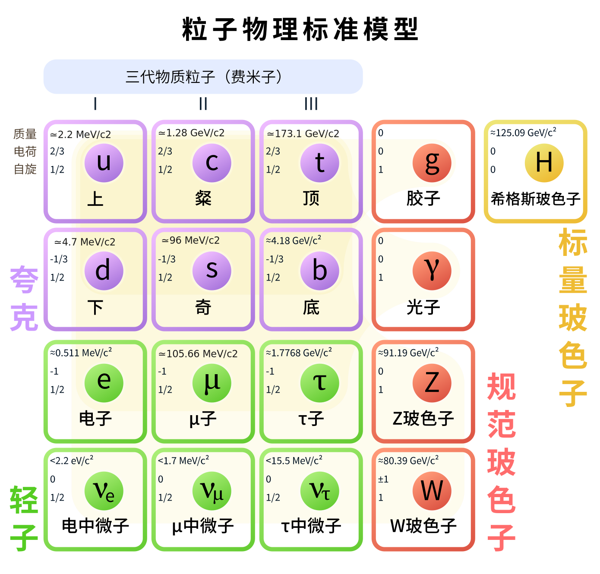

## 
基本粒子

标准模型共含有$61$种基本粒子，其中$48$种费米子（$12$种轻子和$36$种夸克）构成物质，$12$种媒介子传递相互作用，$1$种希格斯玻色子作为质量的来源。不同种粒子的差距主要体现为各种量子数和质量的不同。

### 轻子（12种）

轻子的分类标准为四个量子数：电荷数$Q$，电子数$L_e$，$\mu$子数$L_{\mu}$和$\tau$子数$L_{\tau}$。借此，可以分出如下三代六种轻子：电子$\mathrm{e}^{-}$，电子中微子$\nu_\mathrm{e}$，$\mu$子$\mu^{-}$，$\mu$子中微子$\nu_{\mu}$，$\tau$子$\tau^{-}$和$\tau$子中微子$\nu_{\tau}$。相应量子数如下表所示

|        |   轻子类型   | $Q$  | $L_{e}$ | $L_{\mu}$ | $L_{\tau}$ |
| :----: | :----------: | :--: | :-----: | :-------: | :--------: |
| 第一代 |     $\mathrm{e}^{-}$      | $-1$ |   $1$   |    $0$    |    $0$     |
|        |   $\nu_\mathrm{e}$    | $0$  |   $1$   |    $0$    |    $0$     |
| 第二代 |    $\mu^{-}$     | $-1$ |   $0$   |    $1$    |    $0$     |
|        | $\nu_{\mu}$  | $0$  |   $0$   |    $1$    |    $0$     |
| 第三代 |    $\tau^{-}$    | $-1$ |   $0$   |    $0$    |    $1$     |
|        | $\nu_{\tau}$ | $0$  |   $0$   |    $0$    |    $1$     |

上述轻子的自旋都是$1/2$，即它们是费米子，因此上述每种轻子都有其对应的反粒子，反粒子和相应粒子的质量相同，但所有的量子数都相反。因此还可以得到对应上述轻子的反粒子的另外六种轻子：

|        |   轻子类型   | $Q$  | $L_{e}$ | $L_{\mu}$ | $L_{\tau}$ |
| :----: | :----------: | :--: | :-----: | :-------: | :--------: |
| 第一代 |     $\mathrm{e}^{+}$      | $1$ |   $-1$   |    $0$    |    $0$     |
|        |   $\bar{\nu}_\mathrm{e}$    | $0$  |   $-1$   |    $0$    |    $0$     |
| 第二代 |    $\mu^{+}$     | $1$ |   $0$   |    $-1$    |    $0$     |
|        | $\bar{\nu}_{\mu}$  | $0$  |   $0$   |    $-1$    |    $0$     |
| 第三代 |    $\tau^{+}$    | $1$ |   $0$   |    $0$    |    $-1$     |
|        | $\bar{\nu}_{\tau}$ | $0$  |   $0$   |    $0$    |    $-1$     |

### 夸克（36种）

夸克的分类标准为分数电子数$Q$和四个整数量子数：奇异数$S$，粲数$C$，顶数$U$和底数$B$。为了自洽，下列的表格中还列出下数$D$和上数$U$，但他们对夸克的分类是不必要的，通过其他量子数已经可以确认夸克类型。

由五个量子数可以分出六种夸克

|        |   夸克类型   |  $Q$   | $D$  | $U$  | $S$  | $C$  | $B$  | $T$  |
| :----: | :----------: | :----: | :--: | :--: | :--: | :--: | :--: | :--: |
| 第一代 | $\mathrm{d}$ | $-1/3$ | $-1$ | $0$  | $0$  | $0$ | $0$ | $0$ |
|        | $\mathrm{u}$ |   $2/3$    | $0$  | $1$ | $0$  | $0$ | $0$ | $0$ |
| 第二代 | $\mathrm{s}$ |  $-1/3$    | $0$  | $0$ | $-1$ | $0$ | $0$ | $0$ |
|        | $\mathrm{c}$ |  $2/3$   | $0$  | $0$ | $0$  | $1$ | $0$ | $0$ |
| 第三代 | $\mathrm{b}$ |  $-1/3$   | $0$  | $0$  | $0$ | $0$ | $-1$ | $0$ |
|        | $\mathrm{t}$ |  $2/3$   | $0$  | $0$  | $0$ | $0$ | $0$ | $1$ |

### 媒介子（12种）

传递相互作用

### 希格斯粒子（1种）

123

## 
由基本粒子构成的粒子

### 强子

介子和重子

## 
总结

我们已经知道三代物质粒子都是费米子，因此它们都有反粒子；我们也知道色荷的区别将夸克分为3种，胶子分为8种。现在如果默认这一点，就可以简单写出如下图所示的标准模型粒子示意图

